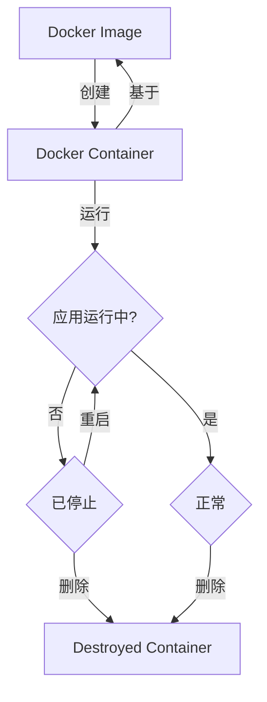

# BionetServer-No1使用说明-进阶（Docker方式）


Version:1.0

基础篇更新记录：

- 简化了文档的内容，拆分了文档分为入门和进阶使用，Docker版本添加R的使用，删除了Matlab版本的内容，请使用桌面版本。


Date: 2024.06.07

Authors：NeoNeuxs

<!-- toc -->

[TOC]


## 开发的最佳实践

开发的最佳实践基于docker来实现，使用docker已经成为世界上最流行最重要的开发模式，学习如何使用docker来进行开发，不管你走到哪里，是科研还是进入大厂，这一套开发方式的部署会让你受益无穷。下面将简单介绍一些基础概念，由于篇幅限制，介绍的不是很详细，但能帮你有一个初步的了解。

**使用Docker的优势：**

- **便于管理者管理环境**
- **快速在多台部署有Docker基础环境的机器上运行，可以在不同的机器中迁移运行，无需重复部署开发环境。**
- **支持集群部署**
- **root权限**
- **高性能的虚拟，容器部署30s内即可完成**

**第一次查看此文档建议按照顺序看，第一创建成功之后建议使用模板方法快速创建。**

### Docker的使用与创建

下图展示了Docker的基本运行原理，其运行在一个基本的操作系统上，并在一个Docker支持多个运行的基本环境。


下图展示了传统的VM（虚拟机）架构，是运行在硬件的抽象层之上的，并且每一个虚拟机都有一个操作系统的支持，就是对应的Guest Operating System。


开发的最佳实践主要是在于使用docker来进行环境的配置和使用。

### image（镜像）和container（容器）的关系

**镜像（Image）**：Docker镜像是一个静态文件，其中包含了应用程序运行所需的所有文件系统内容、库和配置。镜像是一个只读的模板。它可以用来创建一个或多个容器。

**可以简单理解镜像是一个制作好就无法修改的模板**

**容器（Container）**：Docker容器是镜像的运行实例。它实际上是一个独立的、轻量级的、可执行的软件包，包含了运行应用程序所需的一切：代码、运行时、库、环境变量和配置文件。容器可以被创建、启动、停止、删除和移动。每个容器都是相互隔离的，具有自己的文件系统、网络和进程空间。

**容器可以看作一个镜像的动态转变，将其从静态唤醒变成一个应用，可以运行修改。**

下面的状态图，阐述了使用过程中的状态改变：



简单理解了容器和镜像的关系，我们可以尝试安装docker并在docker部署一个应用，这个应用可以是很多种类型，比如：部署一个Rstudio或者部署一个可以使用显卡的运行环境（依赖环境也是一种应用）。

### Docker本身的安装

这里不再赘述，可以参考另一篇维护的文章，当中Docker部署的部分。

### 通过portainer构建自己的容器

portainer部署在No1服务器上，portainer是用来管理所有docker的管理软件，同时也部署在docker之上，使用portainer来创建容器的目的是减少命令的输入，方便用户使用，降低docker的使用门槛，图形化的管理界面也比较直观的展现了所有容器的信息，减少创建过程的问题，同时Portainer具有服务器集群管理，节点拓展等功能，为以后实验室服务建设添砖加瓦。

首先登录你的[Portainer](https://10.26.58.61:9443/#!/auth)

每个人的账户已经创建好了，需要登陆密码私聊我即可。

目前被部署在：https://10.26.58.61:9443/

**注意端口号为9443**

登录页面如图：


登录之后进入到管理界面：


点击链接按钮之后，下图就是其管理界面：


不过这里不是我们的主要目的，我们将目标放到右侧选项栏之中：


对于使用者来说，右侧的状态栏我们只关心这四个内容，Containers、Images、NetWorks、Volumes，下边将简单介绍一下这四个内容并在介绍的同时创建一个属于你自己的世界（容器）。

#### Images（镜像）

我们先来看一下Images页面，images实际上就是镜像，镜像是一个已经制作好的某一个容器的copy，这个镜像在制作完之后和使用之前是无法更改的，也就是说镜像实际上就是某一套环境的固化版本、无法修改当中的内容，只能使用当中的内容。


可以看到我们有一个不太正规命名的pytorch镜像，这是我第一次制作的镜像，至于怎么制作镜像和为什么制作镜像请跳转到这一部分的最后一小节我们会在那里详细介绍，不过我们可以通过一个基本的镜像来详细介绍一下镜像如何使用和创建，我们使用这里最后一个镜像来在nvidia的cudnn运行环境来进行测试。

#### container（容器）

容器就是镜像运行起来的状态，这时候镜像内容就由上文中不可修改的状态转变为可修改、可运行、可探查的状态，一个镜像包含了一套完整的运行所需依赖，并由一套自己的文件系统来支持运行，也就说容器和本地服务器是隔离开的、是互相不干扰的，是没有任何关系的（其实并不是，也有一定的逃逸方法，建议大家正常使用就不会遇到这些问题），

来到container页面：


可以看到没有任何东西，这样我们就需要创建一个container，点右边的按钮来创建：


虽然图片上是Nvidia官方的镜像，不过我们可以再打开**images页面**，看一下有什么镜像，选择你需要的镜像来使用即可，下图第一个是一个bionet实验室制作的镜像，里面包含了基础的miniconda，显卡运行环境，常用的linux工具等等，**下图蓝色部分可以复制名字到刚才的位置**。


上图的这个镜像完整安装了pytorch、numpy、pandas等，在base环境下，可以直接使用，属于是开箱即用的水准，没特殊情况推荐这个，拿不准可以来问我。下图是Tensorflow的专用镜像，有专门的介绍，可以跳转到Tensorflow章节。


至于选用哪一个请自行参照上文选择。

设置主机和容器的端口号映射：


主机可使用的端口号在10086-10199之间，每个人使用的数量不受限制，只需要选择没有占用的即可，这里我占用的是10086，所以别人也无法使用了，但是如何查看别人用了什么端口号呢,使用相同的端口号会导致创建失败。

容器需要使用的端口完全取决你的应用需要，比如R就需要8787端口就需要将R的端口映射到10086到10199之间任意一个，当你从你的电脑链接的时候只需要选择你当时映射的主机端口号即可，不需要连接的时候选择8787。

这里我建议你多留一个端口比如容器的10087来映射到10087来使用，这样万一有服务需要使用端口我们只需要重新映射一下服务即可，就不要再重新创建一个端口来使用了。


#### 容器可见设置

**这里的设置不能跳过~**


这里要选择完全，因为要公开使用的端口信息：


#### 容器的配置

最下面就是容器的详细配置了：


关于容器的配置这一部分，需要说明的是，大多数容器的配置都是一致的，只需要修改名字即可，填写请按照我给出的内容来填写，第一部分需要配置的比较少，按照图上的内容配置即可。

##### 存储配置

不要照着下面这张图片直接抄，请先看后边的内容：


**Bind类型不要选错！**

`bind`是绑定本机路径到容器上某个路径之下，实现对应路径的内容在主机和容器之间相互共享的方法。

举个例子：

`type=bind,   source=/home/SoftWares/R_Share    ,    target=/home/R_Share,readonly \`指的是将主机：`/home/SoftWares/P_Share`目录内容绑定到容器的`/home/R_Share`路径，注意这里的sorce指的是你的服务器本机端、target指的是容器端。

这样这部分就可以互相共享文件，readonly指的是权限为可读，这样的设置当然是为防止你使用某一个数据集的时候有别人来篡改数据，这样你也无法完全知晓跑出来的结果。

`type=bind,   source=修改这里/Share_Space,      target=/container/path/Share_Space \`

就没有只读权限这样的担忧，因为这个主机端的文件夹只有你能访问，这个文件需要你修改`修改这里`这四个字改成你的个人home目录：'/home/Neo/Share_Space '举个例子：


当你明白上述目录之后我们来填写上图中的内容，我已经简单写了一份出来，你只要复制其中的路径即可，不要搞错了主机和容器的区别。

```dockerfile
host=/home/SoftWares/P_Share		container= /home/P_Share,	readonly 
host=/home/SoftWares/R_Share		container= /home/R_Share,	readonly 
host=/home/Datasets			container= /home/Datasets,	readonly 
host=/home/NCZone				container= /home/NCZone		Writable
host=/home/Neo/Share_Space		container= /home/Share_Space 	Writable
```

**注意这里的host指的是你的服务器本机端、container指的是容器端**，其他的内容按照图片选择即可。


使用Tensorflow的同学注意需要将上图container的home替换为tf，如下图所示：


##### lable配置


##### 重启策略配置


##### 运行时配置

将页面切换到此处：


shnm大小推荐至少2000MB，最大4000MB，使用的4090成员请在4000MB以上。

此处注意，因为有两组成员共用GPU，请bionet课题组使用如下配置：


另外的成员，请使用如下配置：


最后一定要点击部署！容器才会生效~这个按钮就在基础部分。


创建完成之后我们就来到这个页面，可以看到容器已经在运行了：


我们点击这里按道理是可以进入命令行的：


同时这里也有容器的监控信息：


#### Tensorflow使用Jupyter登录

Tensorflow环境使用Jupyter来使用，在上述镜像建立完成之后，我们首先找到我们映射的端口信息


点击镜像名字查看端口信息:


我们这里使用了32768端口来映射Jupyter的8888端口，我们打开浏览器输入：10.26.58.61:32768


建议第一次就设置好密码，输入密码，这样每次就不用单独去查找API_token了

接下来我们去命令行找到token：


复制对应的token即可使用，也可以选择下边的修改密码来长久登录。Jupyter自带命令行，所以Portainer的界面的命令行无法使用们这里需要注意。

关于Jupyter的使用这里就不再赘述，下面是pytorch的vscode链接方法。

#### 使用VSCode连接容器

下载vscode：[Visual Studio Code - Code Editing. Redefined](https://code.visualstudio.com/)。推荐使用新版。

在连接之前我们先来使用Portainer来重启一下SSH服务，优化conda内容，方便来链接：

我们使用Portainer自带的命令行：


点击这里打开容器的命令行。输入以下命令：

```bash
service ssh restart && conda init && passwd && mkdir ~/.ssh && touch ~/.ssh/authorized_keys && chmod 700 ~/.ssh && chmod 600 ~/.ssh/authorized_keys
```

**命令行中粘贴快捷键为ctrl+shift+v**，这里减一直接复制以后粘贴。

 命令的效果是修改密码，并增加一些系统设置内容。

效果如下所示：


注意这里修改密码要输入两次才可以，如果有一次和上一次输入的不一致就会失败，如下图所示：


**不用紧张，再次输入上一个命令即可。**然后关闭这个页面。

使用最新版的VSCode，这里下载安装就不再赘述了，打开Vscode之后：

新版的vscoe自带remote链接如图所示：


如果没有的话，请去插件市场安装一个：

选择左侧**Extensions**选项卡，在输入框搜索**ssh**，选择安装**Remote-SSH**插件。这里我已经安装。


安装之后让我们打开远程连接：


可以看到有两种链接形式的存在：一个是tunnels另一个是SSH，这里选择SSH，点击加号创建新的连接：


点击之后会让你输入命令：

端口号要更改~

```bash
ssh root@10.26.58.61 -p 10086
```

**这里的-p指代的是端口号，也就是上文中所设置的端口号映射号，SSH服务默认使用22端口号我们将容器的22端口映射到服务器本机的10086端口，所以这里就要使用10086端口作为链接方式，这样我们只需要连接10086端口就可以连接到容器，注意这里的端口号要和你的容器设置保持一致。**

**这里一定要修改成你的端口！！！！！！！！！！！！！！！！**

**你可能会好奇为什么会是root，而不是其他用户，这里使用的root命令，是因为容器里面的root和主机的root并不一致，这里的root是容器中的管理权限用户，和外边并不相关。**

**在你的容器里面你就是root！**

**然后按下回车：**


**一定要记住这个路径，万一有错误可以用到。**


然后右下角会弹出链接提示，选择链接：


没有看到没有选择上也没关系，我们刷新一下列表就能看到链接信息了：


点击链接，输入密码之后开始下载，就说明成功了，容器的root密码为通用的123456：


一般工作在home文件夹下：


可以看到刚才挂载的几个位置：


我们在这里新建一个python脚本来测试：


将以下内容插入：

```python
import torch
import torch.nn as nn
import torch.nn.functional as F
import torch.optim as optim
import torch.backends.cudnn as cudnn
from torchvision import datasets, transforms


class Net(nn.Module):
    def __init__(self):
        super(Net, self).__init__()
        self.conv1 = nn.Conv2d(1, 10, kernel_size=5)
        self.conv2 = nn.Conv2d(10, 20, kernel_size=5)
        self.conv2_drop = nn.Dropout2d()
        self.fc1 = nn.Linear(320, 50)
        self.fc2 = nn.Linear(50, 10)


    def forward(self, x):
        x = F.relu(F.max_pool2d(self.conv1(x), 2))
        x = F.relu(F.max_pool2d(self.conv2_drop(self.conv2(x)), 2))
        x = x.view(-1, 320)
        x = F.relu(self.fc1(x))
        x = F.dropout(x, training=self.training)
        x = self.fc2(x)
        return F.log_softmax(x, dim=1)


def train(model, device, train_loader, optimizer, epoch):
    model.train()
    for batch_idx, (data, target) in enumerate(train_loader):
        data, target = data.to(device), target.to(device)
        optimizer.zero_grad()
        output = model(data)
        loss = F.nll_loss(output, target)
        loss.backward()
        optimizer.step()
        if batch_idx % 10 == 0:
            print('Train Epoch: {} [{}/{} ({:.0f}%)]\tLoss: {:.6f}'.format(
                epoch, batch_idx * len(data), len(train_loader.dataset),
                       100. * batch_idx / len(train_loader), loss.item()))


def main():
    cudnn.benchmark = True
    torch.manual_seed(1)
    device = torch.device("cuda") if torch.cuda.is_available() else torch.device("cpu")
    print("Using device: {}".format(device))
    kwargs = {'num_workers': 1, 'pin_memory': True}
    train_loader = torch.utils.data.DataLoader(
        datasets.MNIST('./data', train=True, download=True,
                       transform=transforms.Compose([
                           transforms.ToTensor(),
                           transforms.Normalize((0.1307,), (0.3081,))
                       ])),
        batch_size=64, shuffle=True, **kwargs)

    model = Net().to(device)
    optimizer = optim.SGD(model.parameters(), lr=0.01, momentum=0.5)

    for epoch in range(1, 11):
        train(model, device, train_loader, optimizer, epoch)

if __name__ == '__main__':
    main()
```

新建之后会有右下角来提示安装对应的语言插件，没提示直接搜索也可以：


在插件市场搜索：

```txt
@id:ms-python.python
```


然后点击安装在远程即可。

#### 开启免密码登录

开启免密码登录方式如下：

首先打开你的ssh配置文件：


打开之后我们先放这里，等下再用。我们把这个路径叫做SSH配置路径，一定要记住这个路径，可以截图。

我们在windos文件管理器中打开这个文件夹：


这里分为两种情况，一种是你已经有了上述`id_rsa.pub`文件，如上图红框所示。

另一种情况是没有这个文件，如下所示：


如果你没有，我们打开本地的系统命令行：


输入以下内容：

```bash
ssh-keygen
```


这里会提示让你输入密钥文件保存在哪里，这里就要放在你刚才的那个路径的文件下面，就是在vscode设置中打开的路径。记住是文件夹，不是文件，文件夹通常名字为：".ssh"。

输入之后一路回车下去直到看到这个图形生成：


这里就结束了，然后我们回过头打开这个文件，使用vscode或者记事本都可以，同时我们也打开远程服务器的这个目录下的文件：

这路径全名是：

```bash
/root/.ssh/authorized_keys
```


打开之后我们将刚才打开的`id_rsa.pub`文件中的内容复制过来，通常如下图所示：


然后我们回到最初打开的ssh配置文件，在你的电脑SSH配置路径上，如果没打开的话，我们还是点击这里打开：


添加一行内容：

```bash
IdentityFile "C:\Users\NeoNexus\.ssh\id_rsa"  这里的路径要修改成你的配置路径，要记得这里的id_rsa文件并不带pub后缀因为这是私钥
```

添加后效果如下：


记得Ctrl+S保存修改

重启VSCode就可以愉快免密码直接使用了。

#### 开启代码补全

由于默认的代码补全并不是很好用这里要修改一下设置：


同时打开terminal来测试：


输入命令：`nvidia-smi`


如图所示，四个显卡都能看见，则创建成功。

使用conda来创建环境，初始化codna：

```bash
conda init
```

重新开一个terminal：


可以看到cnoda已经成功启动了：


在安装之前我们来进行换源，我们将目录切换到这里：


新建一个：


复制以下内容进去，记得ctrl+s保存：

```bash
channels:
  - defaults
show_channel_urls: true
default_channels:
  - https://mirrors.tuna.tsinghua.edu.cn/anaconda/pkgs/main
  - https://mirrors.tuna.tsinghua.edu.cn/anaconda/pkgs/r
  - https://mirrors.tuna.tsinghua.edu.cn/anaconda/pkgs/msys2
custom_channels:
  conda-forge: https://mirrors.tuna.tsinghua.edu.cn/anaconda/cloud
  msys2: https://mirrors.tuna.tsinghua.edu.cn/anaconda/cloud
  bioconda: https://mirrors.tuna.tsinghua.edu.cn/anaconda/cloud
  menpo: https://mirrors.tuna.tsinghua.edu.cn/anaconda/cloud
  pytorch: https://mirrors.tuna.tsinghua.edu.cn/anaconda/cloud
  pytorch-lts: https://mirrors.tuna.tsinghua.edu.cn/anaconda/cloud
  simpleitk: https://mirrors.tuna.tsinghua.edu.cn/anaconda/cloud
  deepmodeling: https://mirrors.tuna.tsinghua.edu.cn/anaconda/cloud/
```

**最近清华源也不太稳定~**，使用后无法下载删除文件恢复默认即可：

使用如下命令清除缓存（想要恢复默认也需要使用这个）

```bash
conda clean -i
```

然后，打开一个新的terminal ，看一下conda是否有更新：

使用命令：`conda info`

结果应是如下：


我们安装一个pytorch来试一试：

```bash
conda install pytorch torchvision torchaudio pytorch-cuda=12.1 -c pytorch -c nvidia
```


点击运行：

这里注意，你的当前目录不一定是你的文件夹，在运行之前要搞明白下方的命令行当前的目录在哪里是不是你想要的位置，因为在python中有很多相对路径要去处理，关于这点我们继续看下一张图：


这里我们使用ls命令：


这里MINIST数据集下载到当前文件夹下：


那么相对路径是./此时的绝对路径是什么呢？

不错就是命令行前端这一部分，我们打开目录就可以看到，数聚集被下载到了这里：


需要注意的是我们在base环境下安装的pytorch，右下角可以切换当前的解释器：


**注意这里应是cuda**


可以看到显卡被占用了：


### 容器的维护

维护自身的容器也非常重要，在运行的时候我们可能建立多个bash，这些bash在切换路径的时候被vscode所遗忘，就会造成内存虚高，这对我们来说是不利的，在运行代码之前，记住一定是运行代码之前，要维护好自己的容器，就少删除一些垃圾bash，使用命令：

```bash
ps -ef | grep shellIntegration-bash.sh
```

命令显示了多少个bash在运行：


我们保留最后一个数字最大的（因为是当前正在使用的这个，数字越大，创建的时候越靠后）

使用命令杀掉前两个：

```
kill -9 10970 11173
```

瞬间清净了~

## R语言连接办法

注意事项：

登录R语言对应的版本的端口即可，需要注意的是，**同时间之可以登录一个版本，切换另一个版本，请先退出此版本登录，再次登陆即可，或者使用两个不同的浏览器，同一个浏览器开启隐私模式也可以**：


如图：


目前版本对应关系：

- 8787 --> 4.3.2
- 10088 --> 4.2.2

#### R的路径共享

R的路径共享如下图，每一个版本都是遵循此图：

除了P_Share其他文件夹都是可读可写的。


#### 修改当前的工作目录

R的默认工作目录看不到这四个文件夹，需要手动设置工作目录，使用命令：

```
setwd("/home/host/")
```

使用之后刷新页面即可。


## Q&A：

### 问题零 通过容器写入的文件无法运行？

容器的用户都是root身份，而UI登陆的是以用户的身份来登陆的，普通用户当然没有权限来操作root的内容，解决办法：

将文件修改成主机所有者，在容器的终端中使用命令

```bash
sudo chown UID 文件/目录路径
```

如果要修改某个文件夹的全部文件，可以使用：

```bash
sudo chown -R UID 文件/目录路径
```

UID信息在UI界面使用命令获取，比如：


打个比方，修改我在主机上：/Datasets/bionet/Dataset/A/ 文件夹的可以使用：

```bash
sudo chown -R 1001 /Datasets/bionet/Dataset/A/
```

这样这个文件夹下所有文件都可以正常使用。

R语言已经实现了UID的同步，所以没有这个问题。

这里放一个在Jupyter中修改权限的的例子：

```bash
# ls -alh
total 8.0K
drwxr-xr-x 2 root root 4.0K Apr 18  2022 .
drwxr-xr-x 1 root root 4.0K Jun  7 15:51 ..
# cd /tf 首先要到对应的文件夹下来操作文件
# ls -alh
total 6.9M
drwxrwxrwx  1 root root 4.0K Jun  7 15:51 .
drwxr-xr-x  1 root root 4.0K Jun  7 15:51 ..
drwxrwxrwx 11 1001 1002   14 Jun  5 05:03 Datasets
drwxrwxrwx  6 root root 6.8M May 26 06:23 NCZone
drwxrwxr--  6 1001 1001 4.0K Jun  7 15:30 Share_Space
drwxrwxrwx  1 root root 4.0K Sep  2  2023 tensorflow-tutorials
# cd Share_Space
# ls -alh
total 28K
drwxrwxr-- 6 1001 1001 4.0K Jun  7 15:30 .
drwxrwxrwx 1 root root 4.0K Jun  7 15:51 ..
drwx------ 4 root root 4.0K Jun  7 15:30 .Trash-0
drwxr-xr-x 2 root root 4.0K Jun  7 15:30 .ipynb_checkpoints
drwxrwxr-- 6 root root 4.0K May  4 11:07 PTM
drwxrwxr-- 2 1000 1000 4.0K Jun  7 09:13 TEST
-rwxrwxr-- 1 root root 2.2K Apr 23 15:11 test.py
# pwd
/tf/Share_Space
# sudo chown 1001 TEST
# ls -alh
total 28K
drwxrwxr-- 6 1001 1001 4.0K Jun  7 15:30 .
drwxrwxrwx 1 root root 4.0K Jun  7 15:51 ..
drwx------ 4 root root 4.0K Jun  7 15:30 .Trash-0
drwxr-xr-x 2 root root 4.0K Jun  7 15:30 .ipynb_checkpoints
drwxrwxr-- 6 root root 4.0K May  4 11:07 PTM
drwxrwxr-- 2 1001 1000 4.0K Jun  7 09:13 TEST
-rwxrwxr-- 1 root root 2.2K Apr 23 15:11 test.py
```

### 问题一 容器重启之后无法连接？

容器重启之后ssh服务被中断，需要手动重启，打开portainer输入以下命令：

```bash
 service ssh restart
```

即可重新连接。


### 问题二 我创建一个docker失败之后再次连接相同端口为什么不行？

因为ssh有校验措施，只能连接到同一台物理设备，当你的设备失效以后就无法使用，删除过去的key即可重新连接：


### 问题三 我关闭了VSCode代码就停止运行了？

实际上是这样的，SSH需要保持连接才能运行，不过不要紧我们使用命令来将代码任务注册到后台来持久运行，这样你的代码只需要在默认模式下调整好之后，在再使用如下命令即可保持运行：

当我们运行的代码的时候实际上就是在命令行中调用了命令：


我们需要将这个命令和nohup来结合实现运行不掉线：

按方向键盘的上键可以找到上一次运行的命令，当然运行之前要确认当前目录在哪里，是不是你想要的目录？

```bash
(base) root@77d5769f235a:/# cd /home/Share_Space/                          
(base) root@77d5769f235a:/home/Share_Space# ls
data  test.py
(base) root@77d5769f235a:/home/Share_Space# /opt/conda/bin/python /home/Share_Space/test.py
```

下面我们来使用nohup将任务保持在后台，格式如下：

```sh
nohup 你的运行命令 > output.file 2>&1 &
```

结合上边的命令，效果如下：

```bash
nohup /opt/conda/bin/python /home/Share_Space/test.py > output.file 2>&1 &
```

我们来运行一下：


同时可以看到，这里有了对应的输出文件，输出文件保存了所有输出：


当然运行完成之后文件显示的更加准确~

### 问题四 Bad owner or permissions on

如果出现**Bad owner or permissions on C:\\Users\\Administrator/.ssh/config > 过程试图写入的管道不存在。 >**的问题，该问题是config文件权限高，vscode不能修改造成的，两种解决办法第一种是修改原来C:盘的config文件权限；第二种是在其他盘新建一个config文件，用于存储远程连接用户，地址等基本信息。

**第一种解决办法**

a.找到.ssh文件夹。它通常位于C:\Users


b.右键单击.ssh文件夹，然后单击“属性”，选择“安全”


c.单击“高级”。 单击“禁用继承”，单击“确定”。 将出现警告弹出窗口。单击“从此对象中删除所有继承的权限”。

d.此时所有用户都将被删除。添加所有者。在同一窗口中，单击“编辑”按钮，单击“添加”以显示“选择用户或组”窗口。


e.单击“高级”，然后单击“立即查找”按钮。应显示用户结果列表。 选择用户帐户。


f.后面一路点击确定便可。

**记得重启电脑来刷新设置。**

**第二种解决办法**

在除了C盘以外的文件夹新建config文件（空的就可以），在romote-SSH插件的扩展设置中，修改config文件的路径。


