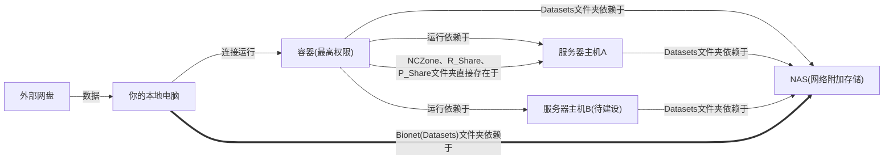

# BionetServer-No1使用说明-进阶（Docker方式）


Version:1.3

Docker篇更新记录：

- 添加了常见错误解决方案
- 添加了复制容器使用说明
- 修改了镜像使用指南
- 重构了Python和R的容器配置


Date: 2026.02.03

Authors：NeoNexus, dlq

<!-- toc -->

[TOC]

## 开发的最佳实践

开发的最佳实践基于Docker来实现，使用Docker已经成为世界上最重要和流行的开发模式，学习如何使用Docker来进行开发，不管你走到哪里，是科研还是进入互联网大厂，这一套开发方式的部署会让你受益无穷。下面将简单介绍一些基础概念，由于篇幅限制，介绍的不是很详细，但能帮你有一个初步的了解。

**使用Docker的优势：**

- **便于使用者管理环境**
- **快速在多台部署有Docker基础环境的机器上运行对应程序，可以在不同的机器中迁移运行，无需重复调整开发环境。**
- **支持集群部署**
- **root权限**
- **高性能，容器部署30s内即可完成**

**第一次查看此文档建议按照顺序看，第一创建成功之后建议使用模板方法快速创建。**

### Docker的使用与创建

下图展示了Docker的基本运行原理，其运行在一个基本的操作系统上，并在一个Docker支持多个运行的基本环境。


下图展示了传统的VM（虚拟机）架构，是运行在硬件的抽象层之上的，并且每一个虚拟机都有一个操作系统的支持，就是对应的Guest Operating System。


开发的最佳实践主要是在于使用Docker来进行环境的配置和使用。

### image（镜像）和container（容器）的关系

**镜像（Image）**：Docker镜像是一个静态文件，其中包含了应用程序运行所需的所有文件系统内容、库和配置。镜像是一个只读的模板。它可以用来创建一个或多个容器。

**可以简单理解镜像是一个制作好就无法修改的模板**

**容器（Container）**：Docker容器是镜像的运行实例。它实际上是一个独立的、轻量级的、可执行的软件包，包含了运行应用程序所需的一切：代码、运行时、库、环境变量和配置文件。容器可以被创建、启动、停止、删除和移动。每个容器都是相互隔离的，具有自己的文件系统、网络和进程空间。

**容器可以看作一个镜像的动态转变，将其从静态唤醒变成一个应用，可以运行修改。**

### 通过portainer构建自己的容器

portainer部署在No1服务器上，**portainer是用来管理所有Docker的管理软件**，同时也部署在Docker之上，使用portainer来创建容器的目的是减少命令的输入，方便用户使用，降低Docker的使用门槛，图形化的管理界面也比较直观的展现了所有容器的信息，减少创建过程的问题，同时Portainer具有服务器集群管理，节点拓展等功能，为以后实验室服务建设添砖加瓦。

首先登录你的[Portainer](https://10.26.58.61:9443/#!/auth)

每个人的账户已经创建好了，需要登陆密码私聊我即可。

目前被部署在：https://10.26.58.61:9443/

使用zerotier的时候地址为：https://10.11.12.166:9443/

**注意端口号为9443**

登录页面如图：


登录之后进入到管理界面：


还有其他服务节点，目前只开放第一个：


点击链接按钮之后，下图就是其管理界面：


不过这里不是我们的主要目的，我们将目标放到右侧选项栏之中：


对于使用者来说，右侧的状态栏我们只关心这四个内容，Containers、Images、Networks、Volumes，下边将简单介绍一下这四个内容的同时介绍创建一个属于你自己的世界（容器）的方法。

#### Images（镜像）

我们先来看一下Images页面，Images中文名称就是镜像，镜像在制作完之后和使用之前是无法更改的，也就是说镜像实际上就是某一套环境的固化版本、无法修改当中的内容，只能使用当中的内容。


可以看到我们有一个不太正规命名的pytorch镜像，这是我第一次制作的镜像，我们可以通过一个基本的镜像来详细介绍一下镜像如何使用和创建，我们使用这里最后一个镜像来在nvidia的cudnn运行环境来进行测试。

#### container（容器）

**容器就是镜像运行起来的状态**，这时候镜像内容就由上文中不可修改的状态转变为可修改、可运行、可探查的状态，一个镜像包含了一套完整的运行所需依赖，并由一套自己的文件系统来支持运行，也就说容器和本地服务器是隔离开的、是互相不干扰的，是没有任何关系的（其实并不是，也有一定的逃逸方法，建议大家正常使用就不会遇到这些问题）。

#### 法1：使用已有容器复制


如图所示，EXAMPLE 是创建的标准容器，R_EXAMPLE则是使用R端口创建的标准容器。通过对标准容器的修改可以可以直接使用别人生成好的容器配置，但需要注意的要修改端口，绑定硬盘路径等参数就可以生成符合你的使用需求的一个新容器。具体操作步骤如下，先点击你想要复制的容器（以EXAMPLE为例，下同）


点击Duplicate/Edit，进入如下界面：


三项修改完成之后记得点击：


来保存容器,之后就会得到一个新的容器了复制容器的好处是简单快捷，可以根据自己的使用场景微调镜像，但是还是推荐大家去看上面的从零开始创建容器的部分，可以深入的了解每个选项的作用，有问题也可以自己简单修复下。

#### 法2：从头制作一个新的容器

以下为从零开始创建一个新容器，**本文也有直接从一个已有容器复制新容器的使用指南**，但是更推荐看完从零开始创建容器并自己动手跟着操作一遍，遇到问题可以随时联系管理人员。

来到container页面：


可以看到没有任何东西，这样我们就需要创建一个container，点右边的按钮来创建：


这里以**docker.1ms.run/neonexusx/bionet_deeplearning:cuda126_torch2100_lightning261_timm1025_uv0514**这个镜像为例，说明一下名字的含义：


`docker.1ms.run/` 代表国内的Docker镜像加速代理服务，`neonexusx` 代表是Docker hub的仓库所属者，`bionet_deeplearning` 代表镜像用途（深度学习），后面的 `cuda126` 代表 CUDA 12.6 版本，`torch2100` 代表 PyTorch 2.10.0 深度学习框架，`lightning261` 代表预装了 PyTorch Lightning 2.6.1 框架，`timm1025` 代表预装了 timm 1.0.25 视觉模型库，`uv0514` 代表存在版本为 0.5.14 的 uv Python 包管理环境。至于选用哪一个请自行按需选择。

#### 容器的配置

##### 端口配置：

主机可使用的端口号在10086-10999之间，每个人使用的数量不受限制，只需要选择没有占用的即可，所以别人也无法使用了，可以先选一个，即使有问题，后面也可以修改


这里的端口配置后，Network要为bridge：


最下面就是容器的详细配置了：


##### 存储配置

按照图中格式配置Volumes:


**Bind类型不要选错！**

`bind`是绑定本机路径到容器上某个路径之下，实现对应路径的内容在主机和容器之间相互共享的方法。

举个例子：

`type=bind,   source=/home/SoftWares/R_Share    ,    target=/home/R_Share,readonly \`指的是将主机：`/home/SoftWares/P_Share`目录内容绑定到容器的`/home/R_Share`路径，注意这里的sorce指的是你的服务器本机端、target指的是容器端。

这样这部分就可以互相共享文件，readonly指的是权限为可读，这样的设置当然是为防止你使用某一个数据集的时候有别人来篡改数据，造成你完全无法知晓跑出来的结果。

**同时因为容器是以root权限来运行的，如果不使用readonly来限制很有可能你一条rm命令将大家的数据都删除了，这将造成无法挽回的后果。**

`type=bind,   source=修改这里/Share_Space,      target=/container/path/Share_Space \`

Share_Space目录就没有只读权限这样的担忧，因为这个主机端的文件夹只有你能访问，这个文件需要你修改`修改这里`这四个字改成你的个人home目录：'/home/Neo/Share_Space '举个例子：


##### 存储配置的最佳实践

下图展示了存储配置的最佳实践，需要结合**NAS使用指南**和当前讲解来理解：


```mermaid
graph LR;
    A["容器(最高权限)"] 
    B["服务器主机A"]
    F["服务器主机B(待建设)"]
    C["NAS(网络附加存储)"]
    D["你的本地电脑"]
    E["外部网盘"]
    
    
    A--"Datasets文件夹依赖于"--->C
    A--"运行依赖于"--->B
    A--"运行依赖于"--->F
    B--"Datasets文件夹依赖于"--->C
    F--"Datasets文件夹依赖于"--->C
    A--"NCZone、R_Share、P_Share文件夹直接存在于"--->B
    D =="Bionet(Datasets)文件夹依赖于"==>C
    D--"连接运行"--->A
    E--"数据"-->D
```

红色的路径为推荐的上传数据集的方式：详见NAS使用说明。


##### 重启策略配置


##### 运行时配置

将页面切换到此处：


此处注意，因为有两组成员共用GPU，请bionet课题组使用如下配置：


另外的成员，请使用如下配置：


最后一定要点击部署！容器才会生效.


#### 使用 Portainer修改密码，重启容器的 ssh 服务

在创建号容器后，先使用Portainer来修改密码，重启容器的SSH服务

1. 我们使用Portainer自带的命令行：

   

2. 输入passwd，输入两次密码，修改成功: `passwd`


3. 重启容器的ssh服务: `service ssh restart`

   


#### 使用VSCode连接容器

vscode版本不要随意升级，因为插件版本和vscode版本绑定，随意升级会导致冲突，没有bug，请不要升级。

新版的vscoe自带remote链接如图所示：


如果没有的话，请去插件市场安装一个：

选择左侧**Extensions**选项卡，在输入框搜索**ssh**，选择安装**Remote-SSH**插件。这里我已经安装。


安装之后让我们打开远程连接：


可以看到有两种链接形式的存在：一个是tunnels另一个是SSH，这里选择SSH，点击加号创建新的连接：


点击之后会让你输入命令：

端口号要更改~

```bash
ssh root@10.26.58.61 -p 10086
```

**此处的 `-p` 参数用于指定 SSH 连接端口。由于 SSH 服务默认监听 22 端口，而本例中已将容器的 22 端口映射至服务器主机的 10086 端口，因此连接时需填写 10086。请务必确保此端口号与容器实际配置的端口映射保持一致。**请务必将端口号修改为您实际分配的端口！！！

关于为何使用 `root` 用户而非其他用户：此处的 `root` 指的是容器内部的管理员账户，与宿主机的 `root` 用户并不相同。二者权限互不影响。在容器环境中，您即拥有容器内的 `root` 权限。

**最后，按下回车键继续：**


**一定要记住这个路径，万一有错误可以用到。**


然后右下角会弹出链接提示，选择链接：


没有看到没有选择上也没关系，我们刷新一下列表就能看到链接信息了：


点击链接，输入密码之后开始下载，就说明成功了，容器的root密码为之前在portainer中修改的密码：


一般工作在home文件夹下：


可以看到刚才挂载的几个位置：


#### 初始化conda环境

1. 在终端键入以下命令：

```bash
echo 'export PATH=/opt/conda/bin:$PATH' >> ~/.bashrc
source ~/.bashrc
```

2. 初始化conda环境：

```bash
conda init
```


3. 新开一个终端就可以看到在base环境中了


#### 测试：在`/home/Share_Space`新建python脚本来测试：


将以下内容插入：

```python
import torch
import torch.nn as nn
import torch.nn.functional as F
import torch.optim as optim
import torch.backends.cudnn as cudnn
from torchvision import datasets, transforms


class Net(nn.Module):
    def __init__(self):
        super(Net, self).__init__()
        self.conv1 = nn.Conv2d(1, 10, kernel_size=5)
        self.conv2 = nn.Conv2d(10, 20, kernel_size=5)
        self.conv2_drop = nn.Dropout2d()
        self.fc1 = nn.Linear(320, 50)
        self.fc2 = nn.Linear(50, 10)


    def forward(self, x):
        x = F.relu(F.max_pool2d(self.conv1(x), 2))
        x = F.relu(F.max_pool2d(self.conv2_drop(self.conv2(x)), 2))
        x = x.view(-1, 320)
        x = F.relu(self.fc1(x))
        x = F.dropout(x, training=self.training)
        x = self.fc2(x)
        return F.log_softmax(x, dim=1)


def train(model, device, train_loader, optimizer, epoch):
    model.train()
    for batch_idx, (data, target) in enumerate(train_loader):
        data, target = data.to(device), target.to(device)
        optimizer.zero_grad()
        output = model(data)
        loss = F.nll_loss(output, target)
        loss.backward()
        optimizer.step()
        if batch_idx % 10 == 0:
            print('Train Epoch: {} [{}/{} ({:.0f}%)]\tLoss: {:.6f}'.format(
                epoch, batch_idx * len(data), len(train_loader.dataset),
                       100. * batch_idx / len(train_loader), loss.item()))


def main():
    cudnn.benchmark = True
    torch.manual_seed(1)
    device = torch.device("cuda") if torch.cuda.is_available() else torch.device("cpu")
    print("Using device: {}".format(device))
    kwargs = {'num_workers': 1, 'pin_memory': True}
    train_loader = torch.utils.data.DataLoader(
        datasets.MNIST('./data', train=True, download=True,
                       transform=transforms.Compose([
                           transforms.ToTensor(),
                           transforms.Normalize((0.1307,), (0.3081,))
                       ])),
        batch_size=64, shuffle=True, **kwargs)

    model = Net().to(device)
    optimizer = optim.SGD(model.parameters(), lr=0.01, momentum=0.5)

    for epoch in range(1, 11):
        train(model, device, train_loader, optimizer, epoch)

if __name__ == '__main__':
    main()
```

新建之后会有右下角来提示安装对应的语言插件：


没提示直接搜索也可以，在插件市场搜索：

```txt
@id:ms-python.python
```

同时还需要python静态检查套件，作为语法检查。


这里有两个安装位置，分别是在本地和远程，记住我们要在远程安装对应的插件才会生效：


安装后，记得在右下角更新环境选择：


同时打开terminal来测试：


输入命令：`nvidia-smi`


如图所示，四个显卡都能看见，则创建成功。

**运行test.py:**

在/home/Share_Space的base环境下执行test.py:


这里我们使用ls命令：


这里是脚本对应的输出，MINIST数据集会下载到当前文件夹下：


那么相对路径是./此时的绝对路径是什么呢？

不错就是命令行前端这一部分，我们打开目录就可以看到，数聚集被下载到了这里：


需要注意的是我们在base环境下安装的pytorch，右下角可以切换当前的解释器(使用base环境即可，预装了一下库)：


**注意这里应是cuda**


可以看到显卡被占用了：


### 容器的维护

维护自身的容器也非常重要，在运行的时候我们可能建立多个bash，这些bash在切换路径的时候被vscode所遗忘，就会造成内存虚高，这对我们来说是不利的，在运行代码之前，记住一定是运行代码之前，要维护好自己的容器，就少删除一些垃圾bash，使用命令：

```bash
ps -ef | grep shellIntegration-bash.sh
```

命令显示了多少个bash在运行：


我们保留最后一个数字最大的（因为是当前正在使用的这个，数字越大，创建的时候越靠后）

使用命令杀掉前两个：

```
kill -9 10970 11173
```

瞬间清净了~
