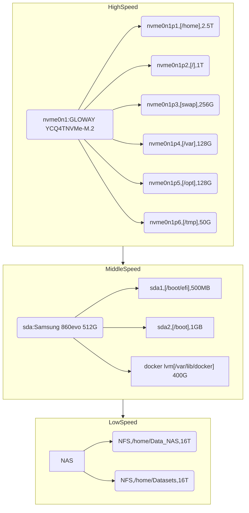

# BionetServer-No1使用说明-基础篇


Version:1.0

基础篇更新记录：

- V1.0 简化了文档的内容，拆分了文档分为入门和进阶使用。添加了Anaconda的使用介绍，方便入门。

过往更新记录：

- V1.9 简化了文档的内容，拆分了文档分为入门和进阶使用，删除了容器Matlab的内容。
- V1.8 新增了R使用说明，划分了端口和详细的版本，简单撰写了使用注意事项。
- V1.7 新增了UI使用说明，同时请注意显卡使用。
- V1.6 新增了Tensorflow专用的镜像，使用Tensorflow的可以使用新的镜像，运行速度提升两倍。
- V1.5版本更新，修复Pytorch shm报错的问题，添加了新的镜像，新的镜像自带pytorch等常用python包，添加了Shared memory size的设置
- V1.4版本更新，修复了桌面版的MATLAB的快捷方式，新增了防止桌面版使用休眠的设置指导，有长时间用桌面版跑代码的同学可以看看，容器不受影响。
- V1.3更新了Matlab使用说明
- V1.2更新了免密码登录，添加了用户修改密码的环节
- V1.1更新代码补全、修正了conda的问题


Date: 2024.06.07

Authors：NeoNeuxs

<!-- toc -->

[TOC]

# 系统信息篇

## 系统硬盘分区

目前系统是由这样的硬盘空间组成的,分为高速、中速、低速区：

顾名思义，每个区域速度不同，速度不同的同时稳定性也存在一定的差异，稳定性和速度正好相反：

`Data_NAS(Datasets) > Samsung 860evo 512G  > GLOWAY YCQ4TNVMe-M.2` 

其中每一条格式如下：[分区名、挂载路径、分区大小]



## 公用文件夹指南

`/home`文件夹：


这其中包含了共享文件夹和用户文件夹，如图共享文件夹使用红框标注，用来传递文件


一共包含六个文件夹：

- Datasets文件夹是用来放置公用数据集的，其命名需要遵循以下方式：`上传者_数据集名称_上传日期`。
  - 此文件夹使用详见：[NAS服务器使用说明 - NeoNexus - 博客园 (cnblogs.com)](https://www.cnblogs.com/NeoNexus/p/18153899)

- Data_NAS是直接连接到NAS的文件夹，其目录内容与Datasets保持一致，但是二者物理通道不同（挂载在不同的IP），使用起来是一模一样的。
- PastData文件夹是过去硬盘中的所有数据，在三个月后将会自动删除，各位及时使用。【现在已经删除】
- NCZone文件夹是没有做任何保护的文件夹，用户随时可写可删除，使用的时候需要小心删除，并避免写冲突问题（多人对同一个文件修改）
- Some_scripts文件夹使用分享一个shell脚本的，用来管理系统方便的，使用需要管理员权限。
- SoftWares文件夹比较特殊：


​	里面包含了P_Share和R_Share,分别挂载到了对应的容器用来分享文件，容器使用的时候只可读，无法写入，需要通过桌面用户来写入文件。也就是说是对用户是可写可读、对容器的用户只可读。P代指python容器，R代指R语言容器的存储空间。二者都被容器挂载。

## 网络端口信息

**端口的使用主要集中在容器。可以通过portainer来查看，portainer如何使用详见docker篇。**

## 软件安装信息

Anaconda：/home/anaconda

Matlab：/home/SoftWares/Matlab

Dcoker：/默认路径

Jetbrains IDEs：/home/SoftWares/Jetbrain

## 基于UI的方式远程连接服务器

首先我们要确认是否连接到了校园网，在系统命令行上使用命令：

```bash
ping 10.26.58.61
```

结果如下则证明你在校园网内。


打开windos远程连接，在状态栏中搜索远程连接，对于Windows系统，家庭版往往没有此功能，需要升级至专业版，具体升级方法可以去某宝买一个激活码，价格在10元左右。询问店家如何激活升级。


打开远程桌面输入远程地址，打开选项：


打开选项之后，输入链接地址：10.26.58.61

然后点击显示选项，参照我这里修改：


然后点击编辑，修改成你的用户名和密码，连接即可。


输入你的用户名和密码：


连接后进入桌面，即可开始使用，如遇到剪贴板不能互相传输、小文件不能传输，请关闭连接重开即可，文件传输依赖于NAS可以参考一下NAS篇介绍。

# 用户篇

## 选择自己喜欢的桌面服务

服务器升级之后存在两个桌面服务二者依托于XRDP实现

### GNOME

GNOME是Ubuntu原生的桌面，其优点是：

界面简洁优雅，是默认的桌面。


可个性化定制的比较多，简单来说就是好看~

### Xfce桌面


相对轻量化一点，性能消耗少一点，二者差不多，关键点还是个人喜好问题。

二者如何切换？

在命令行中执行如下命令：

```bash
echo xfce4-session >~/.xsession
```

此时Xdrp默认启动的桌面就改成 Xcfe4 如果你喜欢你的GNOME桌面可以再切换回去：

使用命令：

```bash
rm ~/.xsession
```

**退出登录之后，注意要退出登录**不是关闭远程连接，重新登陆即可登录到新的桌面。不懂如何退出请看下一小节。

同时开多个个cpu消耗也比较少：


## 如何正确退出远程连接？

开启远程链接之后如果按照以下操作，会话将会保持运行，占用资源，正确退出方法如下：


## 如何关闭锁屏功能

在这里找到设置：


关闭即可。


## 如何配置中文输入法

打开fctix 5：


这里会提示运行fctix 5：


在这里找到拼音：


点击添加并应用：


找到语言设置：


更改设置如下，并登出，重新启动之后


可以愉快使用：

**注意输入法切换要使用ctrl+空格键**


## 基本的开发工具

使用UI开发的基本工具都在：


PyCharm使用的介绍这里不赘述，网上有很多，需要提醒的是选择Python Inter（python解释器）的时候

## Anaconda使用说明

**禁止事项：严禁在用户个人目录下私自安装Anaconda**

### Anaconda，conda，pip

#### Anaconda

The world’s most trusted open ecosystem for sourcing, building, and deploying data science and AI initiatives

和过去大家理解的Python和R语言的发行版，旨在简化包管理和部署的软件，不太相同了，全面拥抱AI，不仅仅是一个Python的发行版本了，提供了AI从数据到部署全部解决方案，不这里不会涉及到太多这些，毕竟这些方式在近些年还并不是最主流的，我们还有docker来部署，但是其作为Python的管理工具还是十分强大的。

#### conda

conda是Anaconda的核心组件，是其包管理器，Conda和pip都是Python的包管理工具，但是conda不仅仅能管理Python也能管理R语言，但是R语言自带了包管理器，Python也自带了包管理器，也就是Pip，那么为什么还需要conda呢?

Conda对比语言自己带的管理器有以下优势：

- Conda支持创建、保存、加载和更新隔离的环境，每个环境可以有不同的包和版本，非常适合多项目开发，换句话话说，conda可以创建虚拟环境，可以切换Python版本。
- Conda支持pip安装的包的管理，pip往往和对应的python版本相绑定，而conda可以管理Python（不仅仅是Python的包，而是某个版本的Python），也就是说conda也能管理Pip及其安装的包，当你使用pip安装对应的包的时候conda也是能察觉到，并更新对应的信息，一同管理。
- Conda有更强的包依赖处理能力，自动删除冲突的包版本并升级，且不会破坏已经存在的包环境，pip直到23.10版本才有此功能，在以前升级包会直接删除包，破环原来的以来环境。

## 服务器端的Anaconda如何使用？

Anaconda提供了UI版本和命令行版本，命令行版本较长使用，UI版本对于不熟悉命令行的用户来说非常好用，在服务器上，打开路径如下：


UI的简单介绍：


下图按钮来打开对应的环境的命令行：


可以看到我们打开了对应的base环境的命令行，同时使用命令安装了numpy：


但是安装失败了：


安装失败的原因很简单，base环境是每个用户都可以看到的，也就是说base环境是公用的，如果放开权限，base环境就会被不同的人使用，这样就有可能造成环境冲突，为了避免这个问题，我们首先要创建自己的环境：


打开命令行，安装numpy，注意这里使用的是pip来安装，目的是为验证conda是否能检测到当前环境安装了numpy：


更新一下索引内容：


可以看到对应的numpy被检测到了：


上文是Anaconda的图形化界面，当然你也可以使用shell当中的：

在命令行中使用命令：

```bash
 conda activate base
```


注意base环境不可以使用，请自己建立环境：

```bash
conda create -n env_name python=3.10
```

其中env_name为你想创建的环境的名字，python后边为创建的版本。

下载地址：

https://www.anaconda.com/download

## Matlab使用说明

**禁止事项：严禁在用户个人目录下私自安装Matlab**

matlab在路径：

```bash
/home/SoftWares/MATLAB/bin
```

再次目录下右键打开命令行，运行matlab即可

```
./matlab
```

或者快捷方式在：


**此命令行为matlab运行所使用，不要关闭。**开启后登陆个人matlab账号即可使用，安装的matlab皆为正版，需要根据学校引导来注册正版账号，引导内容在：https://zhengban.xmu.edu.cn/matlab.html，查看个人用户部分介绍，遵循指南。

#### 报错处理：


根据matlab官方指南，kill掉对应的进程即可，使用命令：

```
ps -fU 用户名 | grep MathWorksServiceHost
```


使用`kill -9  1220267`对应的进程号码即可。

## R语言使用指南

为了方便R语言版本的切换，R语言通过Docker部署，详见Docker篇。

