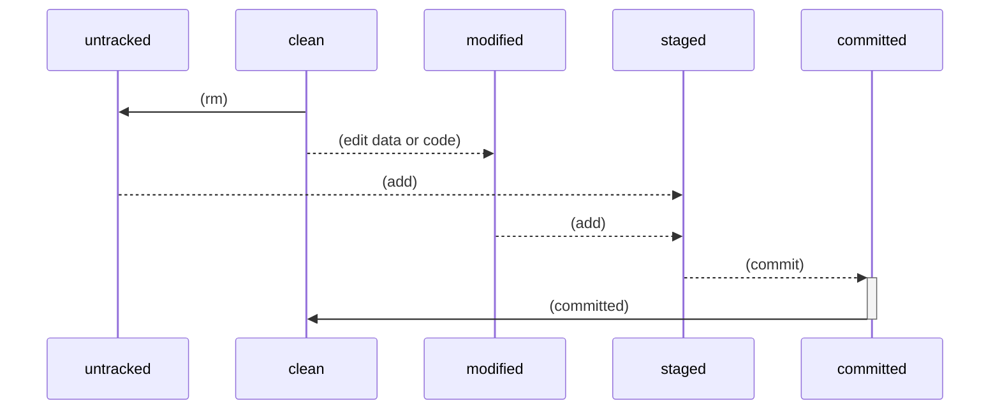
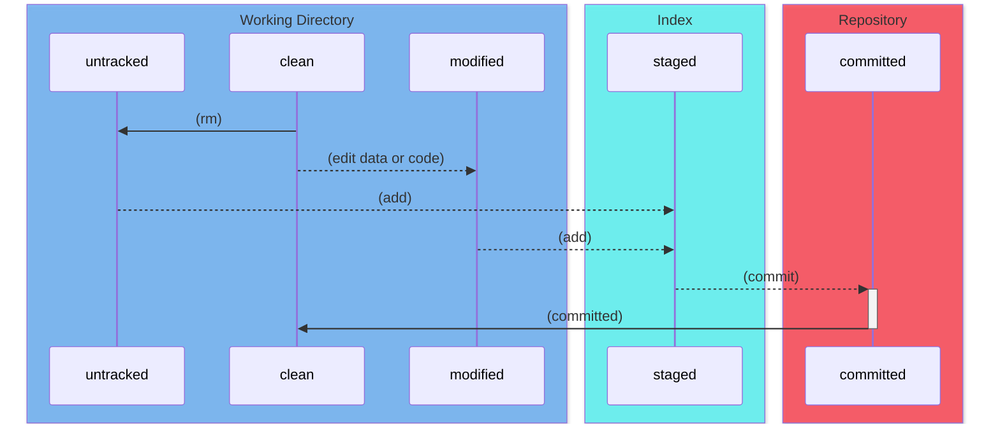
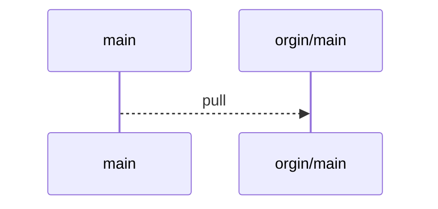
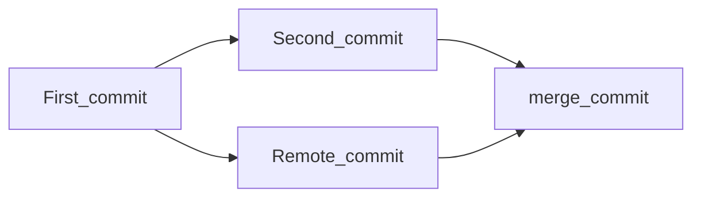
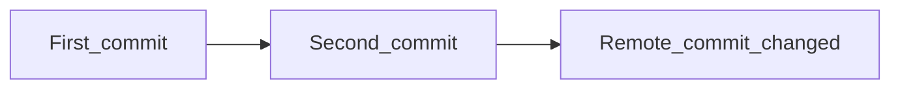

# Git——关于Git的一些补充（1）


## 提示：图床在国外且动图比较多的情况下，需要时间加载。

## 目录：

<!-- toc -->

[TOC]

## Git基础

基础内容请参考[廖雪峰Git教程](https://www.liaoxuefeng.com/wiki/896043488029600)，这里只做一点概念的补充，来方便理解。

### Git文件的生命周期

此部分补充上述教程中**创建版本库**的部分内容

Git所管理的文件可以处于以下五种状态：

未跟踪（untracked）、未修改（clean）、已修改（modified）、已暂存（staged）、已提交（committed）



上图中（浏览器右侧有切换到浅色主题的按钮，使用之后看的更清楚），线上的命令代表了在各个状态变化中使用的命令名称，状态clean和其翻译并对不上，其原因是clean代表的是刚刚完成克隆或者刚刚提交完成之后的仓库状态，详细状态切换及使用的命令的参数可以参考廖雪峰的教程。其中committed部分指的是每次提交完成之后工作区的代码又返回了clean状态，即没有变化，更改的意思，并没有其对应的命令。

由此五种状态的转变可以引出——什么是**仓库**?

Git是如何在存储空间中划分的?

是如何将的代码在各个状态中进行保存的？

### Git文件的存储空间的划分

- **工作目录(Working Directory)：**工作目录实际上是项目中某一个版本的单次检出（check out）。这些文件是从Git目录下的压缩数据库内被提取出，放置在磁盘上以供使用和修改。也就是你能看到的项目内容。
- **暂存区(Stage/Index)：暂存区是一个文件，一般位于Git目录中**，保存了下次提交内容的相关信息。有时候也被称之为**索引**。
- **Git目录(Repository)：**：Git目录是保存项目元数据和对象数据库的地方。这是Git最重要的部分，也是其他计算机中克隆仓库时复制的内容。

在你使用命令之后整个工作流程 上划分如下：



蓝色部分是你的工作区域，也就是你修改的或者使用的代码皆是存在于此的,其中比较重要的是add和commit命令，使用这两个命令或者操作会将文件拉入Index区或者Repository区。受限于mermaid画图无法嵌套，实际上Index应是Repository区的一部分。

### Git安装过程补充说明


在安装过程中，git会让你选择pull操作的逻辑：

Fast-forward操作指的是当前分支所在位置是在已有要合并分支的后面，打个比方：



main节点落后于服务器上的main（以后都称之为origin/main），此时执行Fast-forward操作就是将当把服务器的远程分支合并到main之上，也就是执行merge操作，此时main指针会向前走一个，这样的操作就是Fast-forward。

merge操作指的是在本地分支和远程分支在同一个基点产生分歧的时候如下图所示：



在你的第一次提交之后本地已有个第二次提交，远程也有一个基于第一次提交的远程提交，此时就需要merge将两次提交合并成新的提交：merge_commit，来进行合并。

Rebase操作指的是在上述情况之上直接将Remote_commit修改，再合并到Second_commit之上：



这里选择默认即可。当然git pull --rebase操作不仅仅能实现这种效果，更多内容请参考下一篇，关于分支管理的内容。

### Git的撤销操作

#### 修正上一次的提交

撤销上一次的提交指的是上一次的提交会被这次新的提交所覆盖，假设你的commit信息在上次输入错误了，我们就可以使用：

```bash
git commit --amend
```

来再次进行提交，这次提交还是会打开输入信息框，修改后信息就会更新，且上一次提交就被覆盖了或者说应该是被修正了。

第一次提交：


第二次提交：


#### 撤销暂存区的文件

如果你不小心提交了不该提交的内容到index区，我们可以使用：

```bash
git reset HEAD filename
```

来将其从暂存区中删除，记得不要使用rm，rm同时也会把其从工作区一起删除，这是二者的区别。

### Git的rm命令补充

要从版本管理系统中移除某一个文件，你需要把它先从已跟踪文件列表里面删除，然后再提交修改才可以，这里就要使用rm命令来实现，如果没有使用git rm，而是简单的直接从文件列表删除，就会产生如下后果：

我们将copy结尾的文件删除，其已经被修改后提交：


我们将其手动删除，查看git的状态。


这里就会提示你有一个删除操作没有提交到暂存区，你需要手动使用

```bash
git add .
```

来将删除操作暂存，并用commit命令提交到committed区。


这样的操作略显麻烦，不过问题不大，我们可以直接使用rm命令来进行操作。**rm命令会将文件从暂存区和工作区直接删除**，这样提交的时候就不会有未跟踪的文件提示了。


### Git的diff命令补充

在安装完成之后，我们使用git bash 来查看 diff，在diff查看之前我们应该有一个已经committed的版本，方便我们来查看不同之处，这里使用的就是本篇文章的存储库来查看，

写到这里，我们使用命令：

```bash
git diff
```

效果如下：


上图红红绿绿的部分，就是代表了修改的内容，这个表格是用来查看你相对于索引（index）（下次提交的暂存区域）所做的修改。 换句话说，这些差异是你_可以告诉 Git 进一步添加到索引中，但你仍然没有。，我们从头开始，解析这一段代表的是什么意思。

#### Git diff 解析

git所使用的diff是1990年，GNU diff率先推出了"合并格式"的diff，将需要比较文件的上下文合并在一起显示的一种diff格式、不同的diff格式不同，目前比较多的是GNU diff格式，git在此基础上添加了一些信息，用来显示一些内容。

第一部分实际上是文件的基本信息，用来显示git的对象：

一般格式如下：

```bash
　　diff --git a/f1 b/f1
```

进行比较的是，a版本的f1（即变动前）和b版本的f1（即变动后）。

由于我的文件包含中文，所以中文被解析成了对应的字符，仔细看实际上是能发现对应的内容的：


然后一行显示的是两个版本的git哈希值（index区域的6f8a38c对象，与工作目录区域的449b072对象进行比较），最后的六位数字是对象的模式（普通文件，644权限）

```bash
index a7a1862..fcf1525 100644
```

第三行表示进行比较的两个文件。


"---"表示变动前的版本，"+++"表示变动后的版本。

第二部分，变动的位置用两个@作为起首和结束。

```bash
@@ -33,14 +33,18 @@
```

`-33`中`-`代表第一个文件也就是上一个版本的文件，33代表第33行，`14`代表连续14行，合在一起意思就是从33行起连续14行，同样的，`+`代表变动后的文件，从33行开始一直到18行。

第三部分，就是具体的修改内容了：


文件内容的每一行最前面，还有一个标记位。如果为空，表示该行无变化；如果是感叹号（!），表示该行有改动；如果是减号（-），表示该行被删除；如果是加号（+），表示该行为新增。图片中的`+- --` 均为文档自身包含一个-号，与git无关。

参考：[读懂diff - 阮一峰的网络日志 (ruanyifeng.com)](https://www.ruanyifeng.com/blog/2012/08/how_to_read_diff.html)

## Git的mv命令

git并不会显式的跟踪文件的移动，如果你在文件管理系统中，直接重名了文件，git并不能发觉，会将其认为是一个新的文件，如此这般我们就需要将文件重新加入到跟踪队列，实际上我们可以说使用git mv命令来实现更快捷的操作：

如图我们直接修改文件夹中的README.md文件为README，此时git会发觉到：


不过问题不大我们可以直接用mv来修改，这样git就会自动将其加入到追踪文件中：

```bash
git mv README.md README
```

此时可以看到对应的文件被变成了这个样子：


我们直接提交修改即可。需要注意的是，这一个操作相当于将其改名之后，并将其提交到stage区域，如果你想改回来，就需要将暂存区的内容清空使用上文的reset命令，最后再手动将名字修改回来。

## Github Windows Version Install

很多人上来就要安装Git for windows项目，我是不推荐的，Github针对Git开发了更方便的Github Desktop软件，主要包含GUI和操作，同时也针对了PowerShell做了兼容，这一点非常好。便于跨平台的使用。(这是比较老的说法了，实际上他们放弃了维护CLI部分，专注使用GUI部分，详见：[Where does Github desktop install command line version of Git - Stack Overflow](https://stackoverflow.com/questions/34565238/where-does-github-desktop-install-command-line-version-of-git))，但对新手来说GUI更适合一点，虽然无法使用全部的Git命令，但GUI已经足够了。

下载地址如下：[GitHub Desktop | Simple collaboration from your desktop](https://desktop.github.com/)

下载后注册账号登陆即可：


设置本地Git信息也是易如反掌，我的建议是对于工具类不需要太过深入了解，但是要有求知的心，建议看完Git for Windows项目的教程之后再来看这个会更加理解，本人入门的时候也是用的Git for Windows来进行配置的，整个过程受益颇多。


我们可以简单过一遍教程：


这里省略了几个验证的细节，只需要点点就可以了，来到正式的界面：


右侧写了教程的步骤，这里要我们创建一个新的分支，分支的含义在这里已经详细阐述了，简单来说就是可以允许不同版本的代码同时在相同仓库下进行开发。点击创建新的分支之后：


会使用系统默认的编辑器打开对应文本文件：


在下方添加以下总结信息，这对参与项目者十分重要，来标识你干了什么。


最后将分支推送到Github之上：


pull request，是将你修改好的代码推送到审核人员那里，在审核人员将你实现的功能合并到主分支或者某一个分支之上。


跳转到网页进行申请处理


审核人员审核之后也就是分支合并之后，可以选择删除你的开发分支，删除之后GIt上就剩下了一个分支。

