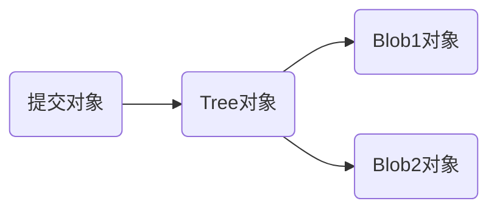
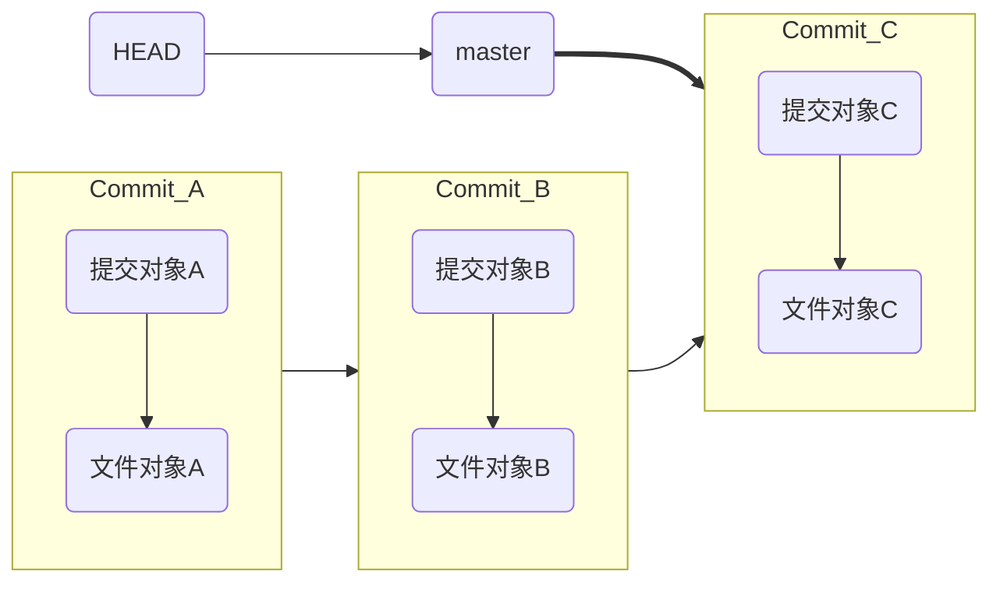
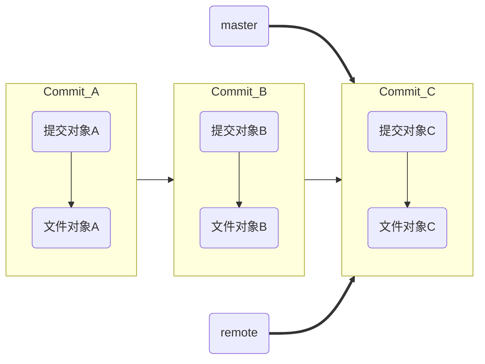
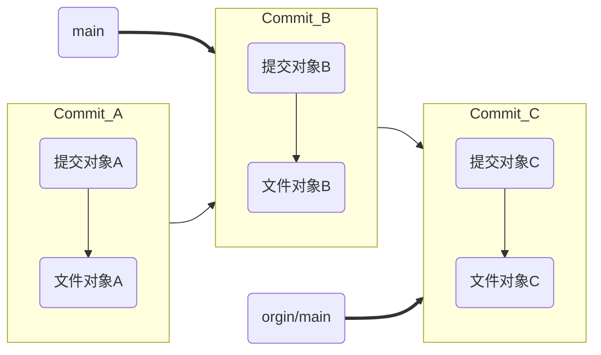
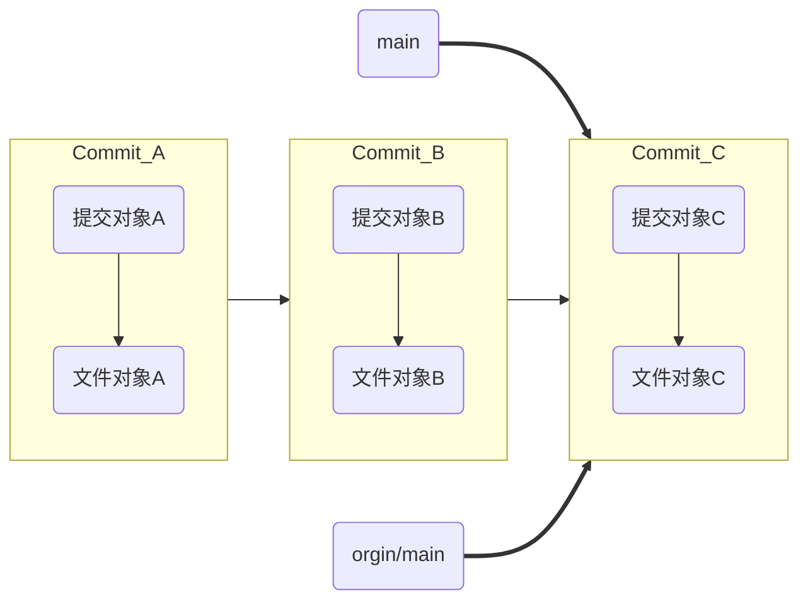
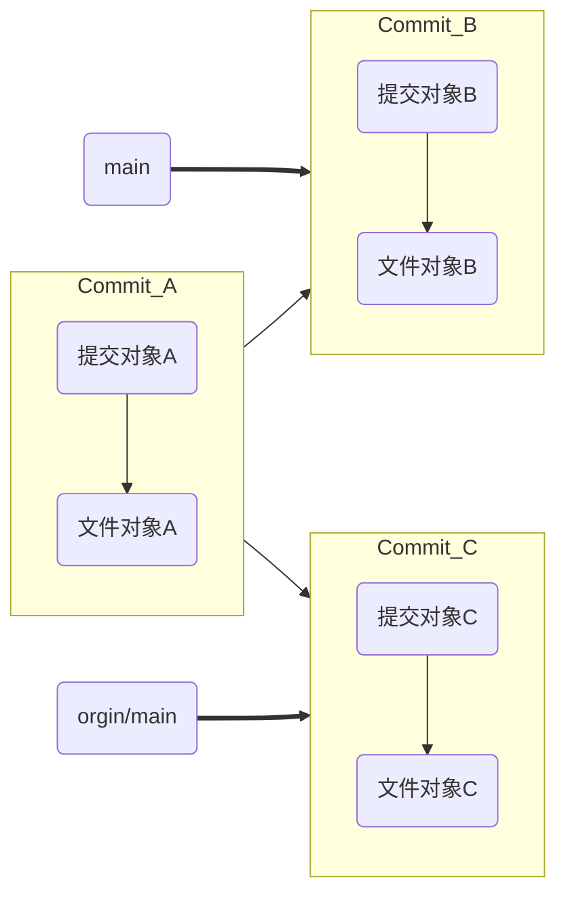
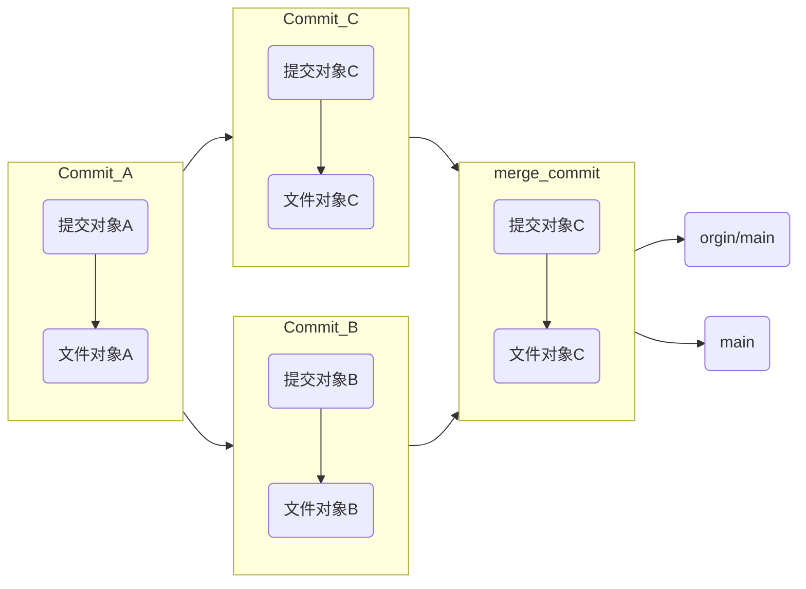

# Git——分支管理（2）


## 提示：图床在国外且动图比较多的情况下，需要时间加载。

## 目录：

<!-- toc -->

[TOC]


## Git基础

关于Git的基础请参考上一篇基础的教程，这里主要是关于Git的分支管理的内容，在讲解完成之后会以实战的形式让各位更好的理解如何使用Git这一个强大的工具。

### Git的分支与HEAD

#### Git的存储机制

当你发起提交的时候，Git存储的是提交对象，其中包含了指向暂存区快照的指针。

Git在仓库区一般会这样保存对象：



- 提交对象，一次提交包含着元数据以及指向项目根目录的树对象的指针，以便需要的时候重新创建这次快照。

  

- Blob 对象，只用于存储单个文件内容，一般都是二进制的数据文件，不包含任何其他文件信息，比如不包含文件名和其他元数据,可以同时有多个。

- Tree 对象，对应文件系统的目录结构，里面主要有：子目录 (tree)，文件列表 (blob)，文件类型以及一些数据文件权限模型等。

Git将文件的快照存储为对象，每个对象都有一个唯一的哈希值。当文件发生变化时，Git会计算新文件的哈希值，并将其作为新对象存储在对象数据库中。当Git检测到两个文件版本相似时，它会计算差异（即两个版本之间的不同之处），并将这些差异作为一个新的对象存储。这个差异对象会引用原始文件的哈希值，以便可以重构原始文件的内容。

#### Git的分支指针

Git的分支只不过是一个指向某次提交的轻量级的可以移动指针，Git默认的分支名是master,当你发起提交的时候就有了一个指向最后一次提交的master分支。每次提交时他都会自己向前移动。

举个例子：



也就是说分支其实就是指针，指针指向某一次提交。其中比较特殊的是HEAD指针，是用来指向当前分支指针的指针，表示当前在master分支上。

### Git的远程仓库

远程分支是指远程仓库的分支指针，这些指针存在于本地且无法被移动，当你与服务器进行网络通信的时候，他会自动更新，也就是使用pull等命令的时候，远程分支有点像书签，会提示你上一次连接服务器时远程仓库中每个分支的位置。



remote指针同master指针一样，都是一个指针而已。

### Git的远程分支管理

合并冲突

Fast-forward操作指的是当前分支所在位置是在已有要合并分支的后面，打个比方：



main节点落后于服务器上的main（以后都称之为origin/main），**此时执行Fast-forward操作就是把本地分支main合并到orgin/main之上**，此时main指针会向前走一个，这样的操作就是Fast-forward。

合并之后结果如下：



merge操作指的是在本地分支和远程分支在同一个基点产生分歧的时候如下图所示：



在你的第一次提交之后本地已有个第二次提交，远程也有一个基于第一次提交的远程提交，此时就需要merge将两次提交合并成新的提交：merge_commit，来进行合并。



Rebase操作指的是在上述情况之上直接将某个分支之上所有提交的更改在另一个分支上重现一遍。

为了Rebase需要先找到两个要整合的分支的共同祖先，然后取得当前所在分支的每次提交引入的变更，并把这些变更保存成文件，这之后将当前分支重置为要整合到的分支，然后在该分支上依次引入之前保存的每个更改。

在合并之前分支已成这个样子：


当我们想把远程分支的内容整合到main分支之上（就是将orgin/main rebase到 main）的话就会有如下情况，合并之后：


可以看到这里实际上变化成了Fast-forward所处理的情况，再次执行Fast-forward（merge）即可完成操作。

## 远程分支和本地仓库的冲突处理

### 查看当前分支情况

查看当前分支信息：

```bash
(base) neo@NeoNeuxs:~/git_test/Essays$ git branch
* main
  test
```

加上参数v可以显示当前每个分支的最新提交和其的提交信息，加上a则会包括当前的远程分支：

```bash
(base) neo@NeoNeuxs:~/git_test/Essays$ git branch -av
* main                dd0258f [ahead 3] Merge branch 'test'
  test                8eafb31 update git rm pycharm
  remotes/origin/HEAD -> origin/main
  remotes/origin/main e5d18d7 del copy
```

`*`代表了HEAD指针所处位置，也就是当前所在的分支。 `update git rm pycharm`就是对应的提交信息。`e5d18d7`就是提交对象的散列值。

如果要查看已并入当前的分支的所有分支信息可以使用：

```bash
(base) neo@NeoNeuxs:~/git_test/Essays$ git branch -av --merged
* main                dd0258f [ahead 3] Merge branch 'test'
  test                8eafb31 update git rm pycharm
  remotes/origin/HEAD -> origin/main
  remotes/origin/main e5d18d7 del copy
```

相反的，显示没有并入分支的命令可以使用（注意这里和上文并不是一个仓库，你可以看到对应的路径不同）：

```bash
(base) neo@NeoNeuxs:~/Desktop/Essays$ git branch -av --no-merged
  remotes/origin/HEAD -> origin/main
  remotes/origin/main e5d18d7 del copy
```

但是以上的方式都不够明显展示分支的变化及历史，所以推荐还是使用如下命令：

```bash
git log --graph --decorate --oneline --all
```

如图展示了两个本地的仓库，其中二者的远程仓库是保持一致的，也就是说二者都有一样的远程信息，但是本地却差别很大，我们的工作就是尽量合并二者的内容并优化分支结构。


在看到二者的分支图的时候我们就能看到：

图中的领先指的是领先远程仓库的意思。


简单来说我们的解决方案如下

首先rebase仓库A,将仓库A的main分支rebase到远程上然后push到服务器。

然后将远程新的内容pull到仓库B，再进行一次rebase然后将内容push到服务器。最终再pull，仓库A、仓库B、服务器三者就可以实现同步。

```bash
(base) neo@NeoNeuxs:~/Desktop/Essays$ git rebase origin/main
Successfully rebased and updated refs/heads/main.
```

reabase之后：


由于仓库B还有部分内容没有提交，这里就再提交一次：

```bash
(base) neo@NeoNeuxs:~/git_test/Essays$ git commit -a -m "finished git 1"
[main e2fdc30] finished git 1
 1 file changed, 61 insertions(+), 6 deletions(-)
```

提交之后分支如下,本次提交并不影响合并方案，只是单纯多加了一次提交而已。


```bash
git pull --rebase
# 等价于：
git fetch origin/main
git rebase origin/main
```


其中的分支变化如下：


关于rebase的变化的解释：

根据精通Git（第二版）的内容，其变基按照如下的方式：

- 判断出分支上那些工作是本地独有的（245d、8ea、dd02、e2fdc）。
- 判断出哪些提交不是合并提交（245d、8ea、e2fdc）。
- 判断出哪些提交并没有被重写到基分支上（orgin/master）（245d、8ea、e2fdc）。
- 把筛选出来的分支重写到基分支上

Git会将合并提交的更改拆分成多个单独的提交，并将它们重新应用在远程分支的顶部。这意味着原始的合并提交（在这个例子中是 `dd0258f`）不再存在于变基后的分支历史中。

245df5e提交和e5d18提交完全一致，并不是有效提交，所以被舍弃。


需要注意的是，没有手动推送上图中test分支，服务器上实际上是没有245df5e,8eafb31的信息的。

参考：精通Git（第二版）
