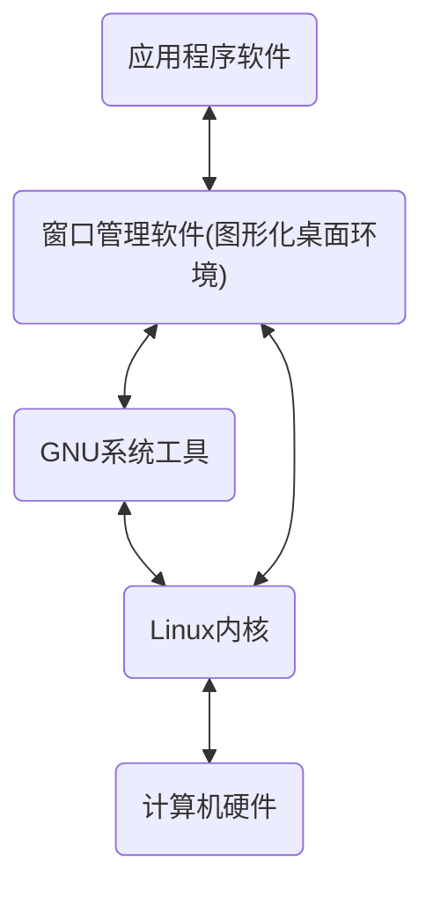

​                                                                                                                                                                                                                                                                                                                                                                                                                                                                                                                                                                                      

---
title: Linux Bash Shell 脚本入门（1）——Linux内核功能介绍
categories:
  - Linux
tags:
  - Linux
excerpt: "Linux core介绍"
date: "2025/03/12 18:37:00"
---

# Linux Bash Shell 脚本入门（1）——Linux内核功能介绍


[TOC]

<!-- toc -->


## 前言

本文为《Linux命令行与shell脚本编程大全》第四版的读书笔记，突发奇想想看看这本书，实际上是图书馆关于Linux的书正好就这一本了，没想到看起来还不错，遂借出来看看。

Linux算是接触的比较多了，虽然接触了很多但是并不明白其原理和架构是怎么样的，整本书包含了部分linux架构的内容，重点在于shell脚本编写实战，这个非常重要，能够书写bash脚本，在某些时候能达到事半功倍的效果，同时对系统的维护工作也是有益的。

## Linux初探

### Linux系统架构

Linux系统有很多版本，我们常见的是Ubuntu、Debian等等，这些版本大同小异，但最关键的系统架构是几乎一致的，一般发行版的linux系统由四部分组成：

- Linux内核
- GNU工具
- 图形化桌面环境
- 应用软件

每一部分都有各自的职责，实际上是一个层次结构的关系，如下图所示： 



### linux 内核

linux系统的核心就是linux内核，创始人linus在赫尔辛基大学上学的时候就开发了第一版linux内核，目前他主要负责编写和审阅linux内核的代码，时至今日linux的开发仍遵循这一思路，只不过不仅仅是linus一个人来进行，目前有一组开发人员负责这项任务。

内核主要负责的功能有：

- 系统内存管理
- 软件程序管理
- 硬件设备管理
- 文件系统管理

#### 系统内存管理

linux系统的内存管理，不仅仅在于物理内存，还可以创建并管理虚拟内存，内核通过硬盘上称为交换空间来实现虚拟内存，内核通过在实际物理内存和虚拟内存之间不停的交换，来使系统的内存容量扩大到远大于物理内存的大小，内核会将内存划分为若干页，内核会将每个内存页面置于物理内存或者交换内存之中。内核会维护一张内存页面表，指明那些页面位于物理内存，那些页面被交换到了磁盘。

内核会记录哪些内存页面正在使用中，自动把一段时间为访问的内存页面复制到交换区域（这操作称为换出，swapping out），当程序要访问一个已经被换出的内存页面，内核就会将物理内存中的另一个页面换出来为其腾出空间，然后从交换空间实行换入操作（swapping in）。显然，这个过程取决于硬盘的读写性能上限和当前的运行状态中是否有较高的读写占用，一般来说这个换入和换出的操作会拖慢程序的运行速度，只要linux系统在运行这个过程就不会停止，因为内核会将长时间不用的内存页面换出，即使当前还有内存可以使用。

关于系统的交换分区和交换文件的设置，可以参考本人另一篇文章：[Ubuntu22.04 & Win11 双系统hibernate冷切换实现](https://www.cnblogs.com/NeoNexus/p/17999581)，里面详细讲述了交换文件和交换分区的内容，并由此为引子实现了双系统的冷切换操作。

#### 软件程序管理

Linux下运行的程序被称为进程，进程可以在前台运行，显示在屏幕之上，也可以后台运行，隐藏到幕后。内核控制Linux系统如何管理运行在系统中的所有进程。

内核通过创建init进程来启动系统中所有的其他进程，当内核启动的时候，它会将init进程载入到虚拟内存。内核启动进程的时候，会在虚拟内存中分配一块专有区域，来存储进程用到的数据和代码。

在linux中，有很多init进程实现的方式，目前最流行的有一下两种：

- SysVinit：Linux最初使用的就是这种方法，该方法基于Unix System V初始方法，目前很多发行版已经不再使用了，但在一些旧的Linux发行版中还能找到其身影。
- systemd：systemd初始化方法诞生于2010年，systemd不仅包含初始化过程，同时包含进程管理的功能。

关于SysVinit初始化方法已经被淘汰，这里就主要介绍systemd的方法，systemd进步在于能够依据不同的事件启动进程，比如一下事件：

- 系统启动时
- 连接到特定的硬件设备时
- 服务启动时
- 建立好网络连接时
- 计时器到期时

systemd方法通过将事件与单元文件（Unit file）链接来决定运行哪些进程，每个单元文件定义了特定事件发生时要启动的程序。

Unit 文件是 systemd 管理资源的基本单位，定义了如何控制一个**服务（Service）、设备（Device）、挂载点（Mount）、定时器（Timer）**等。

- 每个 Unit 文件对应一种资源，例如：
  - `nginx.service`（服务）
  - `home.mount`（挂载点）
  - `graphical.target`（目标）

systemctl程序允许启动、停止和列出系统中当前运行的单元文件。

```shell
systemctl list-units --type=service
```


systemd方法将单元文件划归为目标（target），目标定义了Linux系统的特定状态，在某个目标（target）中就包含了很多单元文件（Unit file），需要注意的是target文件本身就是一种Unit文件类型，二者并不是从属关系的存在。

比如在系统启动的时候，default.target单元定义了要启动的所有单元文件，可以使用systemctl命令查看当前默认目标：

```shell
neo@NeoNeuxs:/etc$ systemctl get-default
graphical.target
```

graphical.target单元文件定义了多用户图形 环境运行时要启动的进程。

这里我们使用systemctl 来启动一个服务，这里的服务是一个云盘的挂载软件：

```shell
systemctl enable --now clouddrive.service
Failed to enable unit: Unit file clouddrive.service does not exist.
```

可以看到报错，没有找到对应的service的Unit单元文件。

#### 硬件设备管理

所谓硬件设备管理，就是通过对应的硬件的驱动，来完成硬件和内核的数据交互。

Linux系统将硬件设备视为一种特殊文件，称为设备文件。设备文件分为3种：

- 字符设备文件：对应每次只能处理一个字符的设备，大多数类型的调制解调器和终端是作为字符设备文件创建的。
- 块设备文件：对应于每次以块的形式处理数据的设备，比如硬盘。
- 网络设备文件：对应于采用数据包发送和接受数据的设备，包含网卡和本地的网络回环设备。网络回环对应的是linux系统允许以常规网络编程的方式同自身通信一般地址127.0.0.1

Linux会为每一个设备创建一种节点的特殊文件，与设备所有的通信都是通过设备节点完成的，每个节点都有一个唯一的数值对，来供linux内核标识，数值对包括一个主设备号和一个次设备号，类似的设备会被划分到主设备号下面，次设备号用于标识主设备下某个特定的设备。

例如，如果你有多个SATA硬盘，它们会共享相同的主设备号，但每个硬盘会有不同的次设备号来区分。

#### 文件管理系统

Linux内核支持多种类型数据的读取，同时支持读写其他操作系统的的文件系统，内核必须在编译时就加入对所有要用到的文件系统的支持。常见的文件系统有：

- EXT1-4: ext是Linux扩展文件系统，最早的Linux文件系统，后续推出了ext2、ext3、ext4,ext4是目前常用的文件系统，支持高级日志功能。
- EXFAT：扩展windos文件系统，常用于大容量移动设备。
- NTFS：NTFS（New Technology File System）是由Microsoft开发的一个文件系统，最初在Windows NT 3.1中引入，并在后续的Windows操作系统中得到广泛应用，包括Windows 2000、Windows XP、Windows Vista、Windows 7、Windows 8、Windows 10以及Windows Server系列。NTFS替代了之前的FAT（File Allocation Table）和HPFS（High Performance File System）文件系统，提供了许多改进和新特性
- SMB：最初由IBM开发，后来由Microsoft进一步扩展和标准化，成为Windows网络环境中文件和打印服务的核心协议。SMB工作在客户端/服务器模型上，允许客户端（通常是计算机或移动设备）通过发送请求消息给服务器（通常是文件服务器或打印服务器）来访问网络上的资源。服务器接收到请求后，处理请求并返回相应的响应给客户端。因此常被用来作为网络硬盘的功能。

内核采用虚拟文件系统作为和各种文件系统互相交互的接口，linux内核与其他类型的文件系统之间的通信提供了一个标准接口，当文件系统被挂载和使用的时候，VFS会在内存中缓存相关信息。
