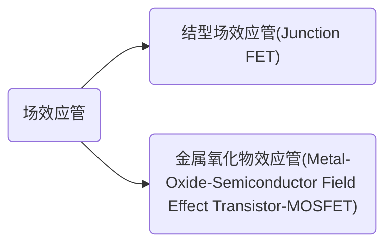
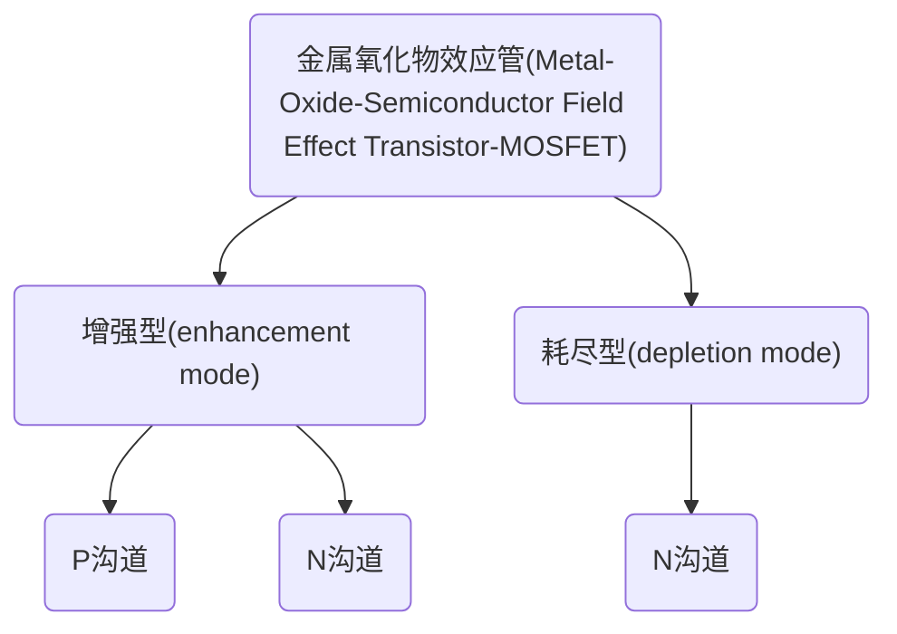

# MOS管 —— 快速复苏应用笔记[原理篇]

此篇内容为MOS管的开篇内容，助你从结构上理解和使用MOS管。

<!-- toc -->

[TOC]

## 场效应晶体管的工作原理

场效应管（Field Effect Transistor —— FET）是单极型晶体管，与双极型晶体管BJT都属于晶体管(Transistor)。在双极型晶体管中，载流子包含电子运动也包含空穴运动，像双重合力一般流向两个极；而在场效应管中，只有一种载流子运动，或者电子或者空穴，流向一个极，因此叫单极型晶体管。

### 场效应管和双极型晶体管的区别和优势

单极型虽然诞生比较晚，但是通过其本是固有的一些优点，比如低噪声、高阻低功耗、热稳定性好等，同时二者都能实现放大功能和开关功能，因此直接就碾压了BJT，其无敌的低功耗为数字芯片领域所青睐，随着时代变化，MOSFET基本完全替代了BJT，只有在部分模拟器中比如：运算放大器、数模转换器、电源模块、超高频、电流放大、低成本应用领域等BJT还占有一定的比例。

### 场效应管的分类和原理图定义

场效应管大致可以分为以下两种：

结型场效应工作电流很小，适合于模拟信号放大，它分为N沟道和P沟道两种。像双极性晶体管中的NPN和PNP一样，M沟道和P沟道仅仅是工作电流的方向相反。结型场效应管由于应用场合有限，数量较少。这里不详细介绍，仅作了解。

MOSFET的分类和BJT就不近相同了，MOSEFT作为最常见的FET首先分为两种类型增强型和耗尽型，在两种类型之下又因为掺杂工艺不同又分为N沟道和P沟道。

当然也有一些区分办法是依据工作电压和电流来区分，一般分为小信号管和功率管两种。

### 场效应管的原理和结构

想要真正了解MOS是如何工作的就必须要知道其物理结构是怎样的，大多数书上的内容这一块都讲的不明不白，今天来根据我所了解的来总结一下。以下内容全部是关于增强型的，因为耗尽型型号比较少，关于两者的区别将在下文中顺便说明。

#### NMOS的内部结构

下图是一个N型MOS的剖面图，我们来通过剖面图详细解说一下。 

可以看到他是用一块掺杂浓度比较低的P型硅片作为衬底，利用扩散工艺在衬底上扩散两个高掺杂浓度的N型区域。

NMOS的源极与漏极上标示的“N+”代表着两个意义：

（1）N代表掺杂（doped）在源极与漏极区域的杂质极性为N；

（2）“+”代表这个区域为高掺杂浓度区域（heavily doped region），也就是此区的电子或空穴浓度远高于其他区域。在源极与漏极之间被一个极性相反的区域隔开，也就是所谓的基极（或称基体）区域。如果是NMOS，那么其基体区的掺杂就是p-type。反之对PMOS而言，基体应该是n-type，而源极与漏极(上图的Drain)则为p-type（而且是高掺杂的P+）。基体的掺杂浓度不需要如源极或漏极那么高，故在左图中没有“+”，作为沟道用。

可以看到在N型区域引出的两个欧姆电极，分别称为源极(Source)和漏极(Drain),为了简化符号书写我们常常使用S和D来分别代表以上的电极。

你可以注意到引出的电极的上层并不是完全空的，而是有一层氧化薄膜，对应上图中就是场氧化层(Filed Oxide),氧化层的材料多半是[二氧化硅](https://zh.wikipedia.org/wiki/二氧化矽)，其下是作为基极的[硅](https://zh.wikipedia.org/wiki/矽)，而其上则是作为栅极的[多晶硅](https://zh.wikipedia.org/wiki/多晶硅)，当然早期的时候这里的多晶硅被替换为铝电极，并将其引出这就是栅极(Gate)。当上层覆盖的氧化层在早期是金属铝的时候，人们通常把这种结构叫金属氧化物效应管，这也是MOS名称的由来。

#### 金属氧化物效应的原理

MOS管在结构上以一个**金属—氧化物层—半导体(基极)**的**电容**为核心，氧化层的材料多半是[二氧化硅](https://zh.wikipedia.org/wiki/二氧化矽)，其下是作为基极的硅，而其上则是作为栅极的多晶硅（早期是金属）。这样的结构正好等于一个[电容器](https://zh.wikipedia.org/wiki/電容器)。氧化层为电容器中[介电质](https://zh.wikipedia.org/wiki/介電質)，而电容值由氧化层的厚度与二氧化硅的**介电系数**来决定。栅极多晶硅与基极的**硅**则成为MOS电容的两个端点。完整的结构如下所示：

##### 累积阶段

当一个电压施加在MOS电容的两端时，半导体的电荷分布也会跟着改变。如下图所示：

在这张图片中，显示了具有不同氧化层厚度的块状p型衬底MOS-CAP的C-V曲线。显示的蓝色曲线是指高频C-V曲线，而红色曲线是指低频C-V曲线。在积累和耗尽阶段，MOS电容与所有频率无关。这是因为在这里，总电荷是由多数载流子控制的。在反转区，电荷由少数载流子支配，形成反转层。由于少数载流子产生的时间有限，在较高的频率下，总电荷不能跟随栅极偏置，这可能导致C-V曲线的差异。这里还值得注意的是阈值电压随不同的氧化层厚度的变化。

电容公式高速我们电容只和介电常数以及厚度和面积相关，所以和电压无关。不过MOS结构的电容会随着电压的变化而变化，所以我们通过C-V曲线来进行分析，由于衬底是P，而积累的也是P-type，所以下电极只是导电特性变好，所有的栅极电压全部加在G上，所以此时电容最大。

##### 耗尽阶段

相反，当一个正的电压*VGD*施加在栅极与基极端（如图）时，空穴的浓度会减少（称为耗尽，如C-V曲线中间所示），[电子](https://zh.wikipedia.org/wiki/電子)的浓度会增加。

##### 反型阶段

当*VGB*够强时，接近栅极端的电子浓度会超过空穴。这个在p-type半导体中，电子浓度（带负电荷）超过空穴（带正电荷）浓度的区域，便是所谓的**反转层**（inversion layer）。

在反型区，也就是Vg大于开启电压时，此时耗尽区宽度达到最大值，所以进入强反型，这个时候的电容达到最小值。当然还有个不容忽略的问题是我们的测试电压的频率，当频率较低时，载流子的速度可以跟的上电压频率的变化，所以此时的反型区是被充电的最终还是达到GOX的厚度。而如果是高频，载流子速度根本赶不上反型区充电速度，所以只能保持在低电容状态。而实际上这个反型区宽度与衬底浓度是有很大关系的(这个可能用Vt与衬底浓度的关系来理解，所以完全可以通过反型区高频电容特性来判断衬底浓度的变化。

MOS电容的特性决定了金氧半场效晶体管的工作特性，但是一个完整的金氧半场效晶体管结构还需要一个提供[多数载流子](https://zh.wikipedia.org/wiki/多數載子)（majority carrier）的源极以及接受这些多数载流子的漏极。

#### 金氧效应与MOS结构的配合工作

##### MOS的真实结构与寄生二极管

理论情况下，一个MOS的封装应该会有四个脚,源极（S）、漏极（D）、栅极（G）外，尚有一**基极**（Bulk或是Body），例如如下所示：

但实际上市面上销售的MOS结构都不是这样的，应该是如下：

这是因为通常把基极和源极接在一起，如上图符号所示，故分布式金氧场效晶体管通常为三端器件。而在集成电路中的金氧半场效晶体管通常因为使用同一个基极（common bulk），所以不标示出基极的极性，而在PMOS的栅极端多加一个圆圈以示区别。

**将衬底也就是B和S连接在一起会导致什么事情呢？**

请看下图：

这是一个NMOS，当衬底和S连接的时候就会像上边一样，此时S到D的通路就会形成一个神奇的东西：**PN结**，如下所示：

**也就是说，当我们直接对NMOS得S和D极加上一个电压的时候，他就会因为PN结直接导通。**而我们将这个形成的二极管称为**寄生二极管**。这是由MOS结构决定的，是不可避免的。

你可能不相信，我们通过仿真来测试一下,电路结构如下：

仿真结果如下：

我们更改一下电路结构，看看DS是否还是导通的？更改后结构如下：

结果如下，果然不导通。

在这里我们需要说明一下：**场效应管(JEFT不是MOS)中，源极和漏极是对称的，可以互换。但是在MOSFET 中，由于衬底和源极在内部已经连同，甚至很多MOSFET内部还在D、S之间并联了一个二极管，注意这里的是真的添加了一个二极管不是体二极管，因此D和S不能互换。**

##### MOS的工作模式

依照在MOS管的栅极、源极，与漏极等三个端点施加的[偏置](https://zh.wikipedia.org/wiki/偏置)（bias）不同，MOS管将有下列三种工作模式。

##### 截止区（亚阈值区或弱反转区）（cutoff, subthreshold or weak-inversion mode）

当 $|V_{GS}| < |V_{th}|$ 时：

$|V_{GS}|$ 代表栅极到源极的偏置差(电压差)，$|Vth|$ 为材料的[临界电压](https://zh.wikipedia.org/wiki/阈值电压),也就是上文金氧效应的达到反型时的电压。这个金氧半场效晶体管是处在[截止](https://zh.wikipedia.org/w/index.php?title=截止&action=edit&redlink=1)（cut-off）的状态，沟道仍保持P断开状态，并没有足够的多数载流子，电流无法流过这个MOS管，也就是这个MOS管不导通。

此时MOS的状态如下：

可以看到指定区域并没有形成可通过区域，而是由基底和掺杂区域形成的耗尽区(depletion region)，此时没有电流可以通过。

##### 线性区（三极区或欧姆区）（linear region, triode mode or ohmic mode）

当 $V_{GS} > V_{th}$ 且 $V_{GD} > V_{th}$ 时：

此处$V_{DS}$为NMOS漏极至源极的电压，则这颗NMOS为导通的状况，在氧化层下方的沟道也已形成。此时这颗NMOS的行为类似一个压控电阻（voltage-controlled resistor），而由漏极向源极流出的电流大小为：
$$
I_{D}=\mu_{n} C_{o x} \frac{W}{L}\left(V_{G S}-V_{t h}-\frac{V_{D S}}{2}\right) V_{D S}
$$
μn是载流子迁移率（carrier mobility）、W是金氧半场效晶体管的栅极宽度、L是金氧半场效晶体管的栅极长度，而***Cox***则是栅极氧化层的单位电容大小。在这个区域内，MOS管的**电流—电压**关系有一个线性方程式，因而称为线性区。

当工作在线性区域的时候MOS的解面图如下：

可以看到对应区域出现了**反转层**，这时候S和D之间出现了Channel。

下图展示了NMOS的漏极电流$I_{DS}$与漏极电压之间在不同$V_{GS}-V_{th}$的关系：

可以看到随着$V_{GS}-V_{th}$的变化能通过的电流大小也持续增加，直到某个电压值可通过的电流大小不再变化，这个电压值就是下边要说的**饱和区（放大区）**。

##### 饱和区（放大区）（saturation or active mode）

当 $V_{GS} > V_{th}$ 时$V_GS保持一定$ 且 $V_{GD} < V_{th}$ 时：

这Mos管为导通的状况，也形成了沟道让电流通过。**但是随着漏极电压(D)增加，超过栅极电压时，会使得接近漏极区的反转层电荷为零**，此处的沟道几乎消失（如下图），这种状况称之为[夹断](https://zh.wikipedia.org/w/index.php?title=夾止&action=edit&redlink=1)（pinch-off）。

这里注意靠近D极的沟道已经消失。下面一张图显示的更加清楚。

注意上图的表达式$V_{DS} > V_{GS}- V_{th}$ 

同时此时的电压差也可以写为：$V_{DS _ \mathrm{dv}}=V_{\mathrm{GS}}-V_{\mathrm{GSTH}}$

在这种状况下，由源极出发的载流子（电子）经由沟道到达夹断点时，会被注入漏极周围的空间电荷区（space charge region），再被电场扫入漏极。此时通过金氧半场效晶体管的电流与其漏极—源极间的电压*VDS*无关，只与栅极电压有关，主要原因在于靠近漏极区的栅极电压已经不足以让沟道反转，而造成所能提供的载流子有限，限制住了沟道的电流大小，关系式如下：
$$
I_{D}=\frac{\mu_{n} C_{o x}}{2} \frac{W}{L}\left(V_{G S}-V_{t h}\right)^{2}
$$
上述的公式也是理想状况下，金氧半场效晶体管在饱和区工作的电流与电压关系式。事实上在饱和区的MOS管漏极电流会因为[沟道长度调制效应](https://zh.wikipedia.org/w/index.php?title=通道長度調變效應&action=edit&redlink=1)而改变，并非与*VDS*全然无关。考虑沟道长度调制效应之后的饱和区电流—电压关系式如下：
$$
I_{D}=\frac{\mu_{n} C_{o x}}{2} \frac{W}{L}\left(V_{G S}-V_{t h}\right)^{2}\left(1+\lambda V_{D S}\right)
$$
我们在这里不考虑MOS的放大作用，优先考虑开关作用，具体等到讲解放大电路的时候再详细考虑。

下图显示了某个N沟道MOS管的转移特性和输出特性图。

所谓转移特性指的是在恒定$V_{DS}$的条件下不同$V_{GS}$的电压条件可输出的电流电大小，即对应了上文饱和区的饱和电流，需要强调的是饱和区的时候通道并没有完全夹断，只是因为限制而导致电流大小无法再上升，也就是上图对应的红色部分和左图。

输出特性图就是右侧的图形，MOS管做开关等应用的时候就是工作在饱和区，通过控制GS在某个数值和0V之间进行切换来让其在导通和不导通之间切换。

为了方便理解在不同区域的切换，我找到下图：

其中$V_{\mathrm{DS \underline{}} \mathrm{dv}}=V_{\mathrm{GS}}-V_{\mathrm{GSTH}} $,本质上是上图中红色和右侧图曲线相交的部分。

#### MOS管的符号

下图显示了常见的增强型mos的符号。

一般我们不讨论耗尽型，下文只讨论增强型。

#### PMOS

这个为P沟道的MOS管符号图，根据上文我们知道P沟道的MOS的基极是N型半导体，上图中箭头实际上标明的是体二极管导通的时候，电流的流向，这里就是从D到S。同时GS电压与对应的体二极管导通方向相反，也就是说GS电压小于0的时候才能正常导通。$V_{GS} < 0 $。

当然有些厂商给的图也很直接，如下图：

这种直接表明了对应的二极管，但是这种一般是真的封装了一个二极管进去，并不是体二极管，这里需要注意。

#### NMOS

这个为N沟道的MOS管符号图，根据上文我们知道N沟道的MOS的基极是P型半导体,上图中的箭头实际上标明的也是体二极管导通的方向，这里说明就是直接加电压在SD之间就能到导通，当然GS电压满足如下的时候才能实现导通：$V_{GS} > 0 $。

当然有些厂商给的图也很直接，如下图：

参考文章：

[如何巧用C-V曲线来查Case](http://blog.zy-xcx.cn/?id=101)。

[WIKI百科](https://zh.wikipedia.org/wiki/%E9%87%91%E5%B1%AC%E6%B0%A7%E5%8C%96%E7%89%A9%E5%8D%8A%E5%B0%8E%E9%AB%94%E5%A0%B4%E6%95%88%E9%9B%BB%E6%99%B6%E9%AB%94)。