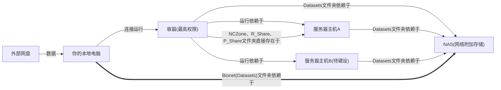
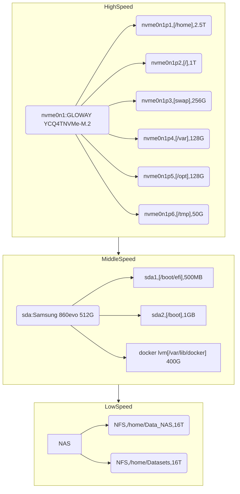

# NAS服务器使用说明


Version:1.0

Date: 2024.04.23

Authors：Tr，NeoNeuxs

<!-- toc -->

## 基本的网络要求

网络要求需要在校园网中，在校园网外需要使用VPN来进行上传。上传文件的速度取决于你的链接速度，推荐使用网线上传。

为什么我的网速很慢？打开校园网链接信息，网线连接的用户，一般不用考虑这个问题，此处可以跳过。


查看连接信息：


应连接到5HZ频段，2.4Ghz频段速度较低，较慢的情况如下：


**72Mbps相当于10M左右的网速，如果上传100GB的数据那就需要100*1000/10 = 10000s，也就是2.78个小时才能完成上传。**所以使用的时候请注意。

如何从2.4Ghz切换到5Ghz？首先电脑支持5Ghz频段才能使用，2.4Ghz频段切换方法如下：


点击**断开连接**后再次点击连接就能查看所连接的信息是否改变，没有改变的情况下，多次尝试即可。

## 目录结构


第一级目录存放了两个文件夹，分别是我个人的用户文件夹，**公用的数据文件夹Dataset**，一般要求如下：


## 如何建立映射来上传内容

1.打开我的电脑，并在左侧右击“此电脑”，然后点击“映射网络驱动器”。


2.弹出弹窗，点击“连接到可用于存储文档和图片的网站”。


3.点两次下一步。


4.输入Internet地址或网络地址：

```
ftp://10.26.58.111
```


5.一定记得**取消匿名登录**！！输入用户名“bionet"。


6.给你这个网络位置起一个名字，这里自己起一个方便自己标识的名字就行，这里我起名叫做bionet-tr。


7.输入密码之后，密码详见群内信息，完成。


8.使用。此时“我的电脑”会出现以下网络连接图标，点击图标进入。此时就可以通过拖拽进行数据上传了。


## 上传内容没有及时更新该怎么办？

映射之后，我们打开：


点击刷新即可：


## 一些使用规则

由于FTP权限管理比较薄弱，各位拥有的权限都比较高，所以请将较大的数据集放入Dataset文件夹：

再强调一遍！请将对应的数据放到Dataset文件夹，按照以下命名规则：

`使用者姓名__数据集名__版本`。举个例子：


**需要强调的是，v是小写，`_`是英文下划线，一个即可。**

**创建之后没有及时显示，请刷新即可**。

私人文件请放入上一层，以自己名字命名的文件夹下，请创建自己的文件夹如图所示：


**创建之后没有及时显示，请刷新即可**。

## 上传之后如何在服务器上使用

该NAS服务器映射在原来服务器的/home/Data_NAS/路径下。进入该路径即可看到所有上传的数据。


## 最佳实践

### 一些基础知识

下图展示了存储配置的全部架构：



在这里再次对主机（服务器主机）上存在的文件解释一下：

主机上的文件存储由这样的硬盘空间组成的,分为高速、中速、低速区。顾名思义，每个区域速度不同，速度不同的同时稳定性也存在一定的差异，稳定性和速度正好相反：

`Data_NAS(Datasets) > Samsung 860evo 512G  > GLOWAY YCQ4TNVMe-M.2` 

其中每一条格式如下：[分区名、挂载路径、分区大小]



这其中包含了共享文件夹和用户文件夹，如图共享文件夹使用红框标注，用来传递文件


一共包含五个文件夹：

- Datasets文件夹是用来放置公用数据集的，其命名需要遵循以下方式：`上传者_数据集名称_上传日期`。
  - 此文件夹使用详见：[NAS服务器使用说明](http://10.26.58.109/2024/09/29/NAS%E6%9C%8D%E5%8A%A1%E5%99%A8%E4%BD%BF%E7%94%A8%E8%AF%B4%E6%98%8E/)
- Data_NAS是直接连接到NAS的文件夹，其目录内容与Datasets保持一致，但是二者物理通道不同（挂载在不同的IP），使用起来是一模一样的。
- PastData文件夹是过去硬盘中的所有数据，在三个月后将会自动删除，各位及时使用。【现在已经删除】
- NCZone文件夹是没有做任何保护的文件夹，用户随时可写可删除，使用的时候需要小心删除，并避免写冲突问题（多人对同一个文件修改），其不被多个服务器所共享，**只保存在No1或者No2服务器上**。
- Some_scripts文件夹使用分享一个shell脚本的，用来管理系统方便的，使用需要管理员权限。

- SoftWares文件夹比较特殊：


里面包含了P_Share和R_Share,分别挂载到了对应的容器用来分享文件，容器使用的时候只可读，部分情况下可以写入，如果报错则说明无法写入（处于权限和安全考虑这样设置的），需要通过桌面用户来写入文件。

P代指python容器，R代指R语言容器的存储空间。

### 最佳实践

简化后的路径当中红色的路径为推荐的上传数据集的方式：


代码等数据集合比较小的可以直接上传：


对于R容器，建议直接使用R_Share或者NCZone,可以考虑如下路径：


Matlab使用路径同其他。